# 🤖 Agentic Design Patterns

[](https://www.python.org/downloads/)
[](https://python.langchain.com/)
[](https://langchain-ai.github.io/langgraph/)
[](https://opensource.org/licenses/MIT)

[](https://github.com/gtesei/agentic_design_patterns/stargazers)
[](https://github.com/gtesei/agentic_design_patterns/network)
[](https://github.com/gtesei/agentic_design_patterns/releases)
[](https://github.com/astral-sh/ruff)

[中文版](README.zh-CN.md)

> **Transform your AI applications from simple prompts to sophisticated intelligent systems.**

## 🧭 Principles

This repo is built around four commitments. They explain what stays in and what gets cut.

1. **Lean, not exhaustive.** This is *not* a catalog of hundreds of patterns that no human will ever read, understand, or remember. It is a **lean catalog meant to be understood and memorized**. Long patterns lists are not features; they are noise.
2. **Hard cap: at most 28 patterns.** If a pattern is not necessary, we remove it. If something new is added, something else gets dropped. The ceiling is a forcing function, not an aspiration.
3. **Demos must actually work.** Every demo runs in an **automated weekly smoke test, for both Python *and* TypeScript** — and it must pass. (See [`.github/workflows/weekly-smoke.yml`](./.github/workflows/weekly-smoke.yml).) Educational code that doesn't run is educational code that lies.
4. **Concrete relevance, not just papers.** For each pattern we measure how it shows up in **real coding agents** — currently [Pi](https://github.com/earendil-works/pi) — and write it down in a `pi.md` inside each pattern folder, plus a [repo-wide roll-up with a coverage heat map](./pi.md). We also maintain [`diff.md`](./diff.md) to disambiguate commonly-confused pattern pairs: **if two patterns can't be cleanly told apart, one of them probably doesn't belong here**. A pattern that only exists in a paper somewhere is a signal it may not belong either.

---

AI evolves too quickly for traditional books to stay current, especially in fast-moving areas like agentic systems. That’s why this is one of the best “living books” on agentic AI: a comprehensive, hands-on collection of design patterns for building robust AI agents, continuously updated with real-world implementations, practical examples, and detailed architectural guidance for scalable, maintainable AI applications.

## Table of Contents

- [📚 Academic Foundations](#-academic-foundations)
- [🏗️ Repository Structure](#-repository-structure)
- [🗂️ Patterns at a Glance](#-patterns-at-a-glance)
- [📚 Foundational Patterns](#-foundational-patterns)
- [🧠 Advanced Reasoning Patterns](#-advanced-reasoning-patterns)
- [🛡️ Reliability Patterns](#-reliability-patterns)
- [🎯 Orchestration Patterns](#-orchestration-patterns)
- [📊 Observability Patterns](#-observability-patterns)
- [🧩 Memory Patterns](#-memory-patterns)
- [🎓 Learning Patterns](#-learning-patterns)
- [🚀 Quick Start](#-quick-start)
- [🗺️ Pattern Selection Guide](#-pattern-selection-guide)
- [🎓 Learning Path](#-learning-path)
- [🛠️ Tech Stack](#-tech-stack)
- [📖 Resources](#-resources)
- [🏛️ Standards & Compliance](#-standards--compliance)
- [📌 How to Cite](#-how-to-cite)
- [🙏 Acknowledgments](#-acknowledgments)

> **New: Pi implementation analyses**
>
> This repository now includes implementation-focused analyses of how they map to [Pi](https://github.com/earendil-works/pi), grounded in the actual Pi codebase with package/module references, line-numbered excerpts, and notes on architectural tradeoffs or limitations.
>
> Look for `pi.md` inside pattern folders. These writeups stay conservative: if Pi does not meaningfully implement a pattern, the analysis says so explicitly rather than forcing a match.
>
> See the [**Pi roll-up summary** (`pi.md`)](./pi.md) for a coverage heat map and one-line verdicts across all 28 patterns.

**Currently available Pi analyses:**
- Foundational: [Prompt Chaining](./foundational_design_patterns/1_prompt_chain/pi.md), [Routing](./foundational_design_patterns/2_routing/pi.md), [Parallelization](./foundational_design_patterns/3_parallelization/pi.md), [Reflection](./foundational_design_patterns/4_reflection/pi.md), [Tool Use](./foundational_design_patterns/5_tool_use/pi.md), [Planning](./foundational_design_patterns/6_planning/pi.md), [Multi-Agent Collaboration](./foundational_design_patterns/7_multi_agent_collaboration/pi.md), [ReAct](./foundational_design_patterns/8_react/pi.md), [HITL](./foundational_design_patterns/10_hitl/pi.md), [Structured Outputs](./foundational_design_patterns/11_structured_outputs/pi.md), [Computer Use](./foundational_design_patterns/12_computer_use/pi.md)
- Reasoning: [Tree of Thoughts](./reasoning/tree_of_thoughts/pi.md), [Graph of Thoughts](./reasoning/graph_of_thoughts/pi.md), [Deep Research](./reasoning/deep_research/pi.md)
- Reliability: [Error Recovery](./reliability/error_recovery/pi.md), [Guardrails](./reliability/guardrails/pi.md)
- Orchestration: [Goal Management](./orchestration/goal_management/pi.md), [Subagents](./orchestration/subagents/pi.md), [Skills](./orchestration/skills/pi.md), [Agent Communication](./orchestration/agent_communication/pi.md), [MCP](./orchestration/mcp/pi.md), [Prioritization](./orchestration/prioritization/pi.md)
- Observability: [Evaluation & Monitoring](./observability/evaluation_monitoring/pi.md), [Resource Optimization](./observability/resource_optimization/pi.md)
- Memory: [Memory Management](./memory/memory_management/pi.md), [Context Management](./memory/context_management/pi.md)
- Learning: [Adaptive Learning](./learning/adaptive_learning/pi.md)

---

## 📚 Academic Foundations

This repository implements design patterns grounded in peer-reviewed research and industry best practices. Key academic contributions include:

### Core Research Papers

#### **Reasoning and Acting**
- **[ReAct: Synergizing Reasoning and Acting in Language Models](https://arxiv.org/abs/2210.03629)** (Yao et al., 2022, ICLR 2023)
  Foundational paper demonstrating that interleaving reasoning traces with actions creates synergy superior to separate reasoning or acting approaches. Directly implemented in our [ReAct pattern](./foundational_design_patterns/8_react/).

#### **Advanced Reasoning Frameworks**
- **[Tree of Thoughts: Deliberate Problem Solving with Large Language Models](https://arxiv.org/abs/2305.10601)** (Yao et al., 2023, NeurIPS 2023)
  Generalizes Chain-of-Thought by enabling exploration over coherent reasoning paths with self-evaluation and backtracking. Implemented in our [Tree of Thoughts pattern](./reasoning/tree_of_thoughts/).

- **[Graph of Thoughts: Solving Elaborate Problems with Large Language Models](https://arxiv.org/abs/2308.09687)** (Besta et al., 2023)
  Extends reasoning to arbitrary graph structures, enabling thought merging and non-hierarchical connections. Achieves 62% quality improvement with 31% cost reduction. Implemented in our [Graph of Thoughts pattern](./reasoning/graph_of_thoughts/).

#### **Agentic RAG**
- **[Agentic Retrieval-Augmented Generation: A Survey on Agentic RAG](https://arxiv.org/abs/2501.09136)** (Singh et al., 2025)
  Comprehensive survey of autonomous AI agents managing retrieval strategies through reflection, planning, tool use, and multi-agent collaboration—transcending static RAG limitations. Informs our [RAG](./foundational_design_patterns/9_rag/) and [Multi-Agent](./foundational_design_patterns/7_multi_agent_collaboration/) patterns.

### Research Impact

These patterns represent the evolution from:
- **Chain-of-Thought** (linear reasoning) → **Tree of Thoughts** (branching exploration) → **Graph of Thoughts** (networked reasoning)
- **Static RAG** (fixed retrieval) → **Agentic RAG** (autonomous, adaptive retrieval)
- **Single-agent systems** → **Multi-agent collaboration** with specialized roles and communication protocols

---

## 🏗️ Repository Structure
```
agentic_design_patterns/
├── foundational_design_patterns/
│   ├── 1_prompt_chain/         # Sequential task decomposition
│   ├── 2_routing/              # Intelligent query routing
│   ├── 3_parallelization/      # Concurrent execution
│   ├── 4_reflection/           # Iterative refinement
│   ├── 5_tool_use/             # External system integration
│   ├── 6_planning/             # Strategic task planning
│   ├── 7_multi_agent_collaboration/  # Coordinated agents
│   ├── 8_react/                # Reasoning and acting
│   ├── 9_rag/                  # Retrieval-augmented generation
│   ├── 10_hitl/                # Human-in-the-loop
│   ├── 11_structured_outputs/  # Schema-constrained outputs
│   └── 12_computer_use/        # Browser/UI automation
│
├── reasoning/                  # Advanced reasoning patterns
│   ├── tree_of_thoughts/       # Systematic exploration
│   ├── graph_of_thoughts/      # Non-hierarchical reasoning
│   └── deep_research/          # Iterative research loops
│
├── reliability/                # Safety and resilience
│   ├── error_recovery/         # Failure handling
│   └── guardrails/             # Safety constraints
│
├── orchestration/              # Multi-agent coordination
│   ├── goal_management/        # Objective decomposition
│   ├── subagents/              # Orchestrator-worker topology
│   ├── skills/                 # Agent-loadable capability packages
│   ├── agent_communication/    # Inter-agent messaging
│   ├── mcp/                    # Model Context Protocol
│   └── prioritization/         # Task ranking
│
├── observability/              # Monitoring and optimization
│   ├── evaluation_monitoring/  # Metrics and quality
│   └── resource_optimization/  # Cost and performance
│
├── memory/                     # Context and history
│   ├── memory_management/      # Long-term memory
│   └── context_management/     # Context optimization
│
├── learning/                   # Continuous improvement
│   └── adaptive_learning/      # Learning from feedback
│
├── tests/                      # Repo-level reliability smoke tests
├── .github/workflows/          # CI workflows
├── repo_support.py             # Shared runtime/bootstrap helper
├── .env                        # Environment variables
├── LICENSE                     # MIT License
└── README.md                   # This file
```

---

## 🗂️ Patterns at a Glance

One-row-per-pattern index for fast navigation. Each row links to the pattern's deep-dive directory; the Pi column links to its `pi.md` implementation analysis where available; the TS column marks patterns with a Bun/TypeScript port under `<pattern>/typescript/`.

| # | Pattern | Category | Pi Analysis | TypeScript |
|---|---|---|---|---|
| 1 | [Prompt Chaining](./foundational_design_patterns/1_prompt_chain/) | Foundational | [pi](./foundational_design_patterns/1_prompt_chain/pi.md) | ✓ |
| 2 | [Routing](./foundational_design_patterns/2_routing/) | Foundational | [pi](./foundational_design_patterns/2_routing/pi.md) | ✓ |
| 3 | [Parallelization](./foundational_design_patterns/3_parallelization/) | Foundational | [pi](./foundational_design_patterns/3_parallelization/pi.md) | ✓ |
| 4 | [Reflection](./foundational_design_patterns/4_reflection/) | Foundational | [pi](./foundational_design_patterns/4_reflection/pi.md) | ✓ |
| 5 | [Tool Use](./foundational_design_patterns/5_tool_use/) | Foundational | [pi](./foundational_design_patterns/5_tool_use/pi.md) | ✓ |
| 6 | [Planning](./foundational_design_patterns/6_planning/) | Foundational | [pi](./foundational_design_patterns/6_planning/pi.md) | ✓ |
| 7 | [Multi-Agent Collaboration](./foundational_design_patterns/7_multi_agent_collaboration/) | Foundational | [pi](./foundational_design_patterns/7_multi_agent_collaboration/pi.md) | ✓ |
| 8 | [ReAct](./foundational_design_patterns/8_react/) | Foundational | [pi](./foundational_design_patterns/8_react/pi.md) | ✓ |
| 9 | [RAG](./foundational_design_patterns/9_rag/) | Foundational | — | ✓ |
| 10 | [Human-in-the-Loop (HITL)](./foundational_design_patterns/10_hitl/) | Foundational | [pi](./foundational_design_patterns/10_hitl/pi.md) | ✓ |
| 11 | [Structured Outputs](./foundational_design_patterns/11_structured_outputs/) | Foundational | [pi](./foundational_design_patterns/11_structured_outputs/pi.md) | ✓ |
| 12 | [Computer Use](./foundational_design_patterns/12_computer_use/) | Foundational | [pi](./foundational_design_patterns/12_computer_use/pi.md) | ✓ |
| 13 | [Tree of Thoughts](./reasoning/tree_of_thoughts/) | Reasoning | [pi](./reasoning/tree_of_thoughts/pi.md) | — |
| 14 | [Graph of Thoughts](./reasoning/graph_of_thoughts/) | Reasoning | [pi](./reasoning/graph_of_thoughts/pi.md) | — |
| 15 | [Deep Research](./reasoning/deep_research/) | Reasoning | [pi](./reasoning/deep_research/pi.md) | — |
| 16 | [Error Recovery](./reliability/error_recovery/) | Reliability | [pi](./reliability/error_recovery/pi.md) | — |
| 17 | [Guardrails](./reliability/guardrails/) | Reliability | [pi](./reliability/guardrails/pi.md) | — |
| 18 | [Goal Management](./orchestration/goal_management/) | Orchestration | [pi](./orchestration/goal_management/pi.md) | — |
| 19 | [Subagents](./orchestration/subagents/) | Orchestration | [pi](./orchestration/subagents/pi.md) | — |
| 20 | [Skills](./orchestration/skills/) | Orchestration | [pi](./orchestration/skills/pi.md) | — |
| 21 | [Agent Communication](./orchestration/agent_communication/) | Orchestration | [pi](./orchestration/agent_communication/pi.md) | — |
| 22 | [MCP](./orchestration/mcp/) | Orchestration | [pi](./orchestration/mcp/pi.md) | — |
| 23 | [Prioritization](./orchestration/prioritization/) | Orchestration | [pi](./orchestration/prioritization/pi.md) | — |
| 24 | [Evaluation & Monitoring](./observability/evaluation_monitoring/) | Observability | [pi](./observability/evaluation_monitoring/pi.md) | — |
| 25 | [Resource Optimization](./observability/resource_optimization/) | Observability | [pi](./observability/resource_optimization/pi.md) | — |
| 26 | [Memory Management](./memory/memory_management/) | Memory | [pi](./memory/memory_management/pi.md) | — |
| 27 | [Context Management](./memory/context_management/) | Memory | [pi](./memory/context_management/pi.md) | — |
| 28 | [Adaptive Learning](./learning/adaptive_learning/) | Learning | [pi](./learning/adaptive_learning/pi.md) | — |

---

## 📚 Foundational Patterns

### 1️⃣ [Prompt Chaining](./foundational_design_patterns/1_prompt_chain/)
**Break complex tasks into sequential, manageable steps**
```python
# Transform a monolithic prompt into a chain of specialized prompts
input → extract_data → transform → validate → final_output
```

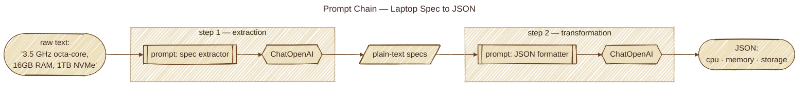

**When to use:**
- Multi-step transformations (data extraction → analysis → formatting)
- Tasks requiring intermediate validation
- Complex workflows that benefit from decomposition

**Key benefits:**
- 🎯 Better accuracy through focused prompts
- 🔍 Easier debugging with visible intermediate steps
- 🔄 Reusable components across workflows

[**📖 Learn More →**](./foundational_design_patterns/1_prompt_chain/README.md) · [**🔎 Pi Analysis →**](./foundational_design_patterns/1_prompt_chain/pi.md)

---

### 2️⃣ [Routing](./foundational_design_patterns/2_routing/)
**Intelligently direct queries to specialized handlers**
```python
# Dynamic routing based on query classification
user_query → classifier → [technical_expert | sales_agent | support_bot]
```

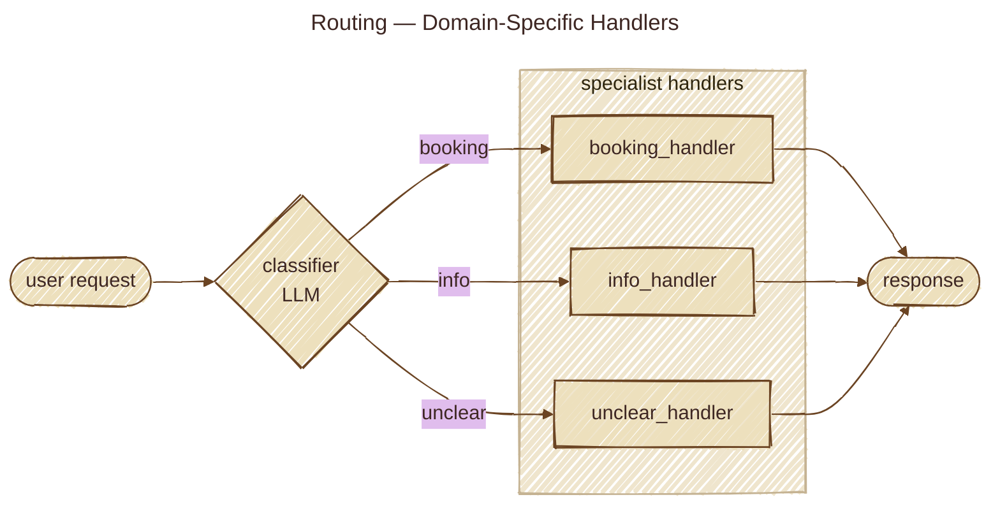

**When to use:**
- Multi-domain applications (support, sales, technical)
- Specialized model selection (fast/cheap vs. slow/accurate)
- Intent-based workflows requiring different processing paths

**Key benefits:**
- 💰 Cost optimization (use expensive models only when needed)
- ⚡ Performance gains (route simple queries to fast handlers)
- 🎨 Specialized handling (domain experts for domain queries)

[**📖 Learn More →**](./foundational_design_patterns/2_routing/README.md) · [**🔎 Pi Analysis →**](./foundational_design_patterns/2_routing/pi.md)

---

### 3️⃣ [Parallelization](./foundational_design_patterns/3_parallelization/)
**Execute independent operations simultaneously for dramatic speedups**
```python
# Sequential: 15 seconds          # Parallel: 5 seconds
task_a(5s) →                      task_a(5s) ↘
task_b(5s) →          vs.         task_b(5s) → combine → output
task_c(5s) → output               task_c(5s) ↗
```

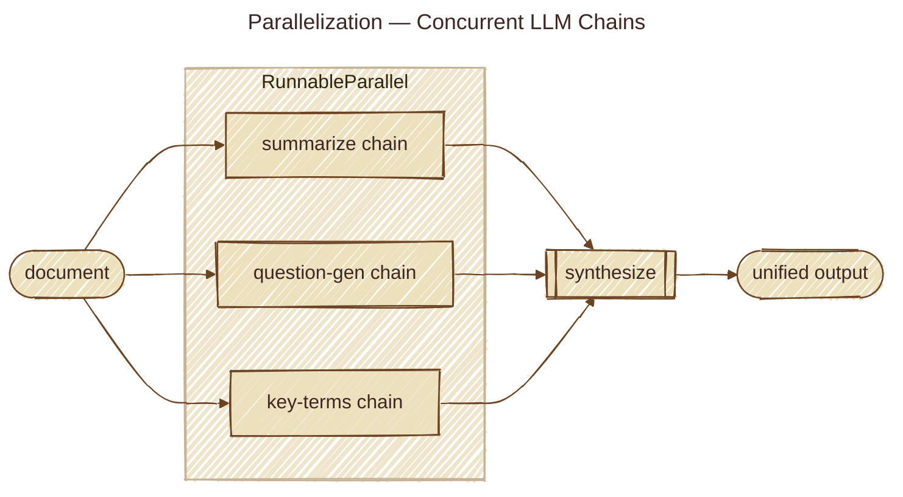

**When to use:**
- Multiple API calls (search engines, databases, external services)
- Parallel data processing (analyze multiple documents)
- Multi-source research or content generation

**Key benefits:**
- ⚡ 2-10x faster execution for I/O-bound tasks
- 📈 Better resource utilization
- 🚀 Improved user experience through reduced latency

[**📖 Learn More →**](./foundational_design_patterns/3_parallelization/README.md) · [**🔎 Pi Analysis →**](./foundational_design_patterns/3_parallelization/pi.md)

---

### 4️⃣ [Reflection](./foundational_design_patterns/4_reflection/)
**Iteratively improve outputs through systematic critique and refinement**

One of the four core agentic design patterns (Ng, 2024), reflection enables AI to systematically critique and improve its own outputs.
```python
# Single-shot: 5/10 quality        # With reflection: 8.5/10 quality
input → generate → done            input → generate → critique → 
                                          refine → critique → final
```

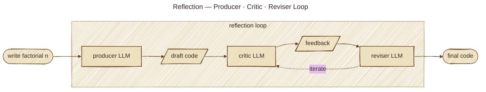

**When to use:**
- High-stakes content (code, legal docs, published articles)
- Complex reasoning tasks (logic puzzles, strategic planning)
- Quality-critical applications where "good enough" isn't enough

**Key benefits:**
- 🎯 50-70% higher quality scores
- 🔍 Systematic error detection and correction
- 🧠 Self-improving outputs without human intervention

**Trade-offs:**
- ⚠️ 3-5x higher token costs
- ⏱️ 4-8x longer execution time

[**📖 Learn More →**](./foundational_design_patterns/4_reflection/README.md) · [**🔎 Pi Analysis →**](./foundational_design_patterns/4_reflection/pi.md)

---

### 5️⃣ [Tool Use](./foundational_design_patterns/5_tool_use/)
**Enable LLMs to interact with external systems and APIs**

Essential for grounding LLM outputs in real-world data and actions, tool use is a foundational capability of modern agentic systems (Ng, 2024; Yao et al., 2022).
```python
# Without tools: Limited to training data
# With tools: Access real-time data and take actions
user_query → LLM decides → call_weather_api(location) → integrate_result → response
```

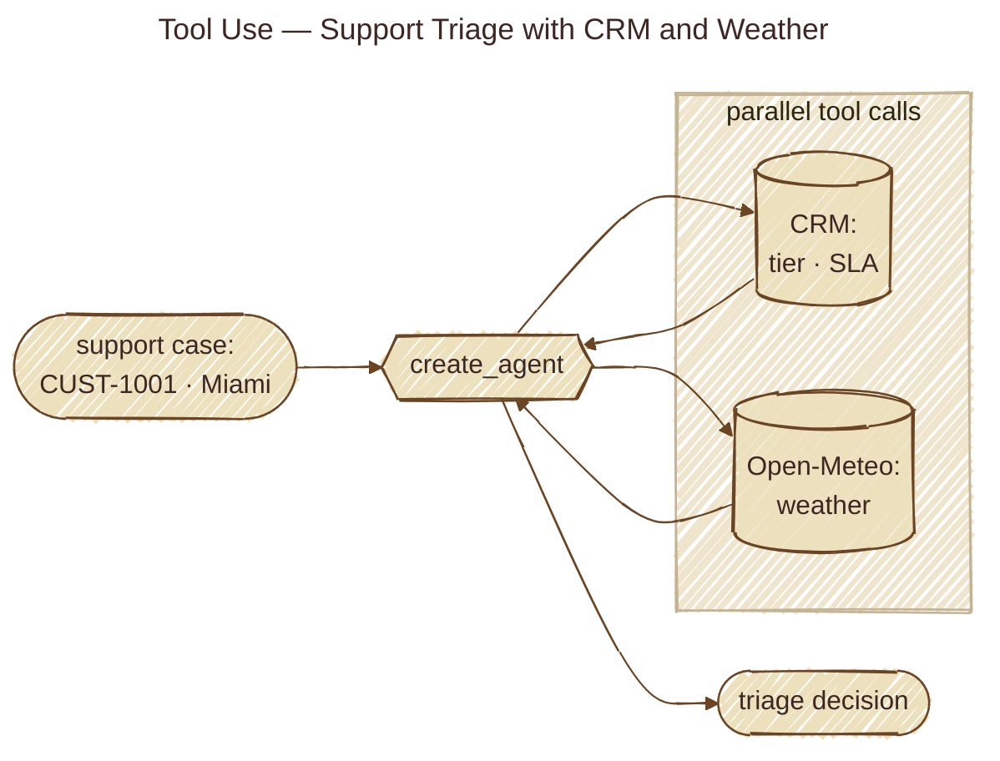

**When to use:**
- Real-time data retrieval (weather, stock prices, news)
- Private/proprietary data access (databases, CRM systems)
- Precise calculations or code execution
- External actions (send emails, update records, control devices)

**Key benefits:**
- 🌐 Access to live, dynamic information
- 🎯 Precise calculations and data validation
- 🔧 Integration with existing enterprise systems
- 💰 Reduced token costs (fetch vs. embed in prompts)

**Trade-offs:**
- ⚠️ Added latency per tool call
- 🔒 Security considerations (authentication, validation)

[**📖 Learn More →**](./foundational_design_patterns/5_tool_use/README.md) · [**🔎 Pi Analysis →**](./foundational_design_patterns/5_tool_use/pi.md)

---

### 6️⃣ [Planning](./foundational_design_patterns/6_planning/)
**Decompose complex goals into structured, executable action plans**

A fundamental capability for agentic systems (Ng, 2024), enabling AI to decompose complex objectives strategically rather than responding reactively.
```python
# Without planning: Reactive, incomplete execution
# With planning: Strategic breakdown and systematic execution
complex_goal → analyze → decompose → plan_steps → execute_sequentially → final_result
```

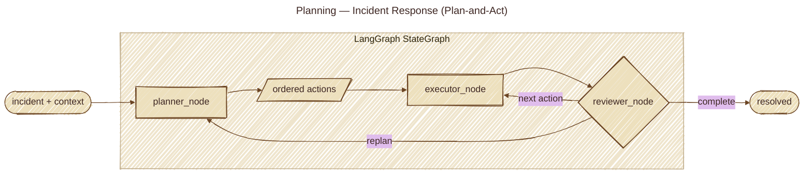

**When to use:**
- Multi-step workflows requiring orchestration (research reports, data pipelines)
- Tasks with interdependent operations
- Complex problem-solving requiring strategic thinking
- Workflow automation (onboarding, procurement, project setup)

**Key benefits:**
- 🎯 Structured approach to complex objectives
- 🧠 Strategic thinking vs. reactive responses
- 🔄 Adaptability through dynamic replanning
- 📊 Transparency into execution strategy

**Trade-offs:**
- ⚠️ Planning overhead (+20-40% tokens, 5-15s latency)
- 🛠️ Requires sophisticated state management

[**📖 Learn More →**](./foundational_design_patterns/6_planning/README.md) · [**🔎 Pi Analysis →**](./foundational_design_patterns/6_planning/pi.md)

---

### 7️⃣ [Multi-Agent Collaboration](./foundational_design_patterns/7_multi_agent_collaboration/)
**Coordinate multiple specialized agents to solve complex tasks**

Multi-agent systems, highlighted in both the Agentic RAG survey (Singh et al., 2025) and production deployments (LangChain, 2024), enable sophisticated task distribution and specialized expertise.
```python
# Agents as a team: specialize roles + coordinate communication
user_goal → manager/planner → [researcher | coder | designer | writer | reviewer] → synthesize → final_output
```

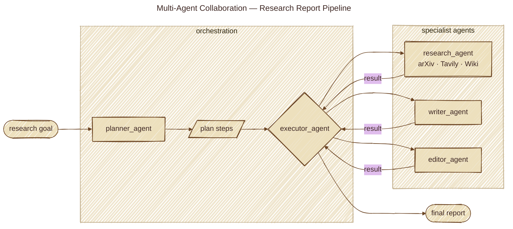

**When to use:**
- Complex tasks requiring diverse expertise (research + writing + QA)
- Workflows with distinct stages (research → draft → edit → package)
- Tool-specialized roles (web search, code execution, image generation)
- Quality-critical pipelines (critic/reviewer loops)

**Key benefits:**
- 🧩 Modularity: build and improve one role at a time
- 🛡️ Robustness: reviewers catch errors / reduce hallucinations
- ⚡ Parallelism: split independent workstreams for speed
- ♻️ Reuse: agents can be reused across multiple products

**Common collaboration models:**
- Sequential handoffs (linear pipeline)
- Supervisor/manager orchestration (hierarchical)
- Parallel workstreams (merge results)
- Debate/consensus (evaluate options)
- Critic–reviewer (quality enforcement)
- Network/all-to-all (exploratory, less predictable)
- Custom hybrids (fit domain constraints)

[**📖 Learn More →**](./foundational_design_patterns/7_multi_agent_collaboration/README.md) · [**🔎 Pi Analysis →**](./foundational_design_patterns/7_multi_agent_collaboration/pi.md)

---

### 8️⃣ [ReAct (Reasoning and Acting)](./foundational_design_patterns/8_react/) (Yao et al., 2022)
**Interleave reasoning traces with tool execution for adaptive problem-solving**

Originally introduced by Yao et al. (2022) in the paper "ReAct: Synergizing Reasoning and Acting in Language Models," this pattern demonstrates that interleaving reasoning traces with task-specific actions creates superior synergy compared to treating reasoning and acting as separate capabilities.

```python
# Traditional: Direct action without explicit reasoning
user_query → tool_call → response

# ReAct: Explicit reasoning + grounded actions
user_query → Thought (reason) → Action (tool) → Observation (result) →
             Thought (adapt) → Action → Observation → Final Answer
```

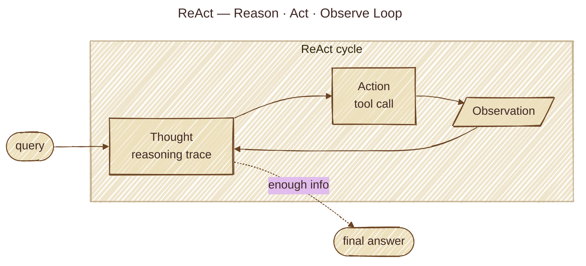

**When to use:**
- Multi-step research requiring information lookup and verification
- Complex problem-solving where the solution path isn't predetermined
- Tasks requiring adaptation based on intermediate results
- Debugging and exploratory analysis
- Need transparent reasoning for interpretability

**Key benefits:**
- 🧠 Explicit reasoning traces improve decision quality
- 🎯 Grounded actions reduce hallucinations
- 🔄 Dynamic adaptation based on observations
- 🔍 Transparent and debuggable decision-making
- ✓ Self-correction and error recovery

**Trade-offs:**
- ⚠️ Higher latency (multiple reasoning + action cycles)
- 💰 Increased token costs (reasoning traces + tool calls)
- 🔁 Risk of unproductive loops without iteration limits

[**📖 Learn More →**](./foundational_design_patterns/8_react/README.md) · [**🔎 Pi Analysis →**](./foundational_design_patterns/8_react/pi.md)

---

### 9️⃣ [RAG (Retrieval-Augmented Generation)](./foundational_design_patterns/9_rag/)
**Ground LLM responses with relevant external knowledge**

This approach, enhanced by agentic capabilities as described in the recent survey by Singh et al. (2025), enables autonomous AI agents to dynamically manage retrieval strategies through reflection, planning, and tool use—transcending the limitations of static RAG workflows.

```python
# Without RAG: Limited to training data
user_query → LLM → response (may hallucinate)

# With RAG: Knowledge-grounded responses
user_query → retrieve_relevant_docs → augment_context → LLM → grounded_response
```

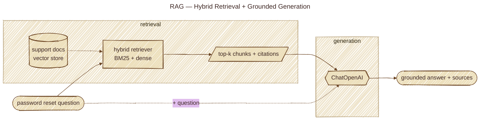

**When to use:**
- Dynamic or frequently updated information (documentation, product catalogs)
- Private/proprietary knowledge bases
- Domain-specific expertise beyond LLM training
- Reducing hallucinations with factual grounding

**Key benefits:**
- 📚 Access to current and proprietary information
- 🎯 Reduced hallucinations through grounding
- 💰 No retraining needed for knowledge updates
- 🔍 Source attribution and transparency

[**📖 Learn More →**](./foundational_design_patterns/9_rag/README.md)

---

### 🔟 [Human-in-the-Loop (HITL)](./foundational_design_patterns/10_hitl/)
**Integrate human oversight and approval into AI workflows**

The Human-in-the-Loop (HITL) pattern represents a pivotal strategy in agentic AI systems, deliberately interweaving the unique strengths of human cognition—such as judgment, creativity, and nuanced understanding—with the computational power and efficiency of AI. This strategic integration ensures that AI operates within ethical boundaries, adheres to safety protocols, and achieves its objectives with optimal effectiveness.

```python
# Without HITL: Fully automated
agent_action → execute → result

# With HITL: Human checkpoint
agent_proposal → human_review → [approve|reject|modify] → execute → result
```

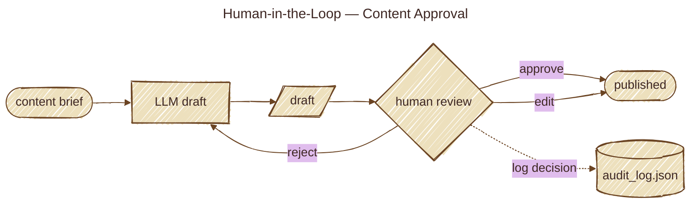

**When to use:**
- High-stakes decisions (financial transactions, legal actions, sentencing)
- Quality-critical content (publications, customer communications)
- Compliance and regulatory requirements
- Complex scenarios requiring nuanced judgment
- Learning from human expertise for continuous improvement
- Tasks involving ambiguity beyond reliable LLM capabilities

**Key aspects:**
- **Human Oversight**: Monitoring AI performance via dashboards/logs to ensure guideline adherence
- **Intervention & Correction**: Human operators rectify errors or guide agents in ambiguous scenarios
- **Feedback for Learning**: Human preferences inform agent learning (e.g., RLHF)
- **Decision Augmentation**: AI provides analysis/recommendations; humans make final decisions
- **Human-Agent Collaboration**: Cooperative interaction leveraging respective strengths
- **Escalation Policies**: Protocols dictating when agents escalate tasks to humans

**Key benefits:**
- 🛡️ Safety and risk mitigation in critical domains
- ✅ Quality assurance and compliance
- 🎓 Continuous learning from human feedback
- 🤝 Building user trust through transparency
- 🎯 Nuanced judgment in complex scenarios
- 🔄 Feedback loops for ongoing improvement

**Practical applications:**
- **Content Moderation**: AI filters at scale; humans review ambiguous cases
- **Autonomous Driving**: AI handles most tasks; humans take control in complex situations
- **Financial Fraud Detection**: AI flags patterns; human analysts investigate high-risk alerts
- **Legal Document Review**: AI scans/categorizes; lawyers review for accuracy and implications
- **Customer Support**: Chatbots handle routine queries; complex/emotional cases escalate to humans
- **Data Labeling**: Humans provide ground truth labels for training datasets
- **Generative AI Refinement**: Human editors review/refine LLM outputs for quality and brand alignment
- **Autonomous Networks**: AI analyzes KPIs; humans approve critical network changes

**Trade-offs & caveats:**
- ⚠️ **Scalability limitations**: Human oversight cannot handle millions of tasks
- 👥 **Expertise dependency**: Effectiveness relies on skilled domain experts
- 🔒 **Privacy concerns**: Sensitive information requires anonymization
- 💰 **Cost considerations**: Human review adds operational overhead

**"Human-on-the-loop" variation:**
In this approach, human experts define overarching policies, while AI handles immediate actions to ensure compliance (e.g., automated trading within human-defined rules, call center routing based on manager-set policies).

[**📖 Learn More →**](./foundational_design_patterns/10_hitl/README.md) · [**🔎 Pi Analysis →**](./foundational_design_patterns/10_hitl/pi.md)

---

### 1️⃣1️⃣ [Structured Outputs](./foundational_design_patterns/11_structured_outputs/)
**Enforce schema-valid LLM outputs for reliable downstream automation**
```python
# Naive parsing (brittle)
text → prompt_json_request → parse_string_json → runtime_fail

# Structured outputs (reliable)
text → response_schema(Pydantic/JSON Schema) → validated_object → safe_automation
```

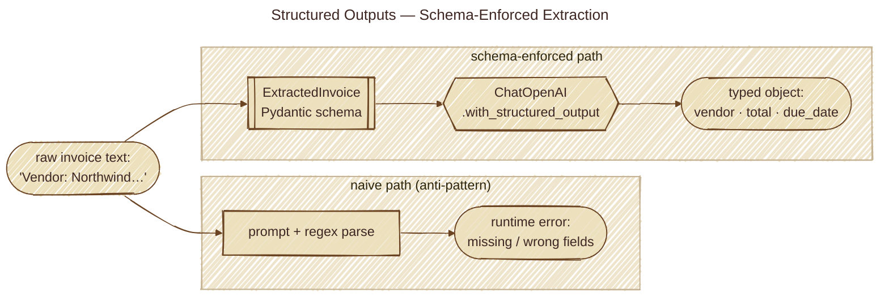

**Key benefits:** Schema guarantees, lower parsing failures, safer agent loops

[**📖 Learn More →**](./foundational_design_patterns/11_structured_outputs/README.md) · [**🔎 Pi Analysis →**](./foundational_design_patterns/11_structured_outputs/pi.md)

---

### 1️⃣2️⃣ [Computer Use](./foundational_design_patterns/12_computer_use/)
**Automate browser/UI workflows with explicit safety controls**
```python
# Observe → Think → Act loop for UI tasks
screenshot/state → reasoning → ui_action(click/type/navigate) → observation → iterate
```

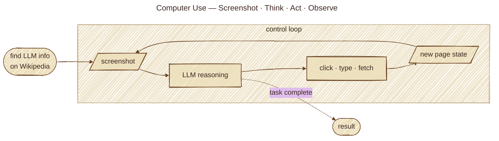

**Key benefits:** Legacy-system automation, UI QA workflows, non-API task coverage

[**📖 Learn More →**](./foundational_design_patterns/12_computer_use/README.md) · [**🔎 Pi Analysis →**](./foundational_design_patterns/12_computer_use/pi.md)

---

## 🧠 Advanced Reasoning Patterns

### [Tree of Thoughts](./reasoning/tree_of_thoughts/) (Yao et al., 2023)
**Explore multiple reasoning paths systematically**

Introduced at NeurIPS 2023, Tree of Thoughts (ToT) generalizes Chain-of-Thought prompting by enabling LLMs to explore multiple reasoning paths, self-evaluate choices, and backtrack when necessary—enabling deliberate problem solving for complex tasks.

```python
# Chain of Thought: Linear reasoning
input → step1 → step2 → step3 → answer

# Tree of Thoughts: Branching exploration
input → [thought1, thought2, thought3] → evaluate → expand_best →
        [refined_thoughts] → evaluate → solution
```

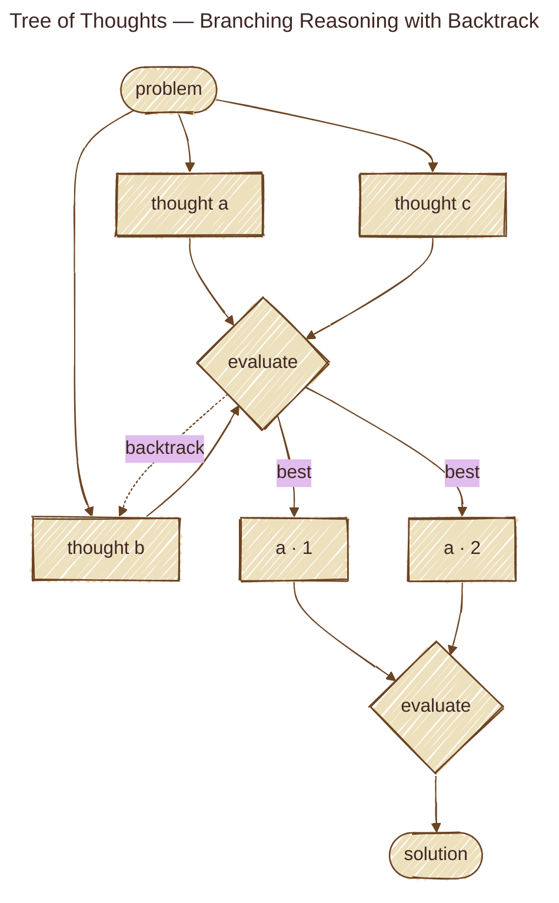

**Key benefits:** Better solutions through systematic exploration, backtracking capability, transparent decision trees

[**📖 Learn More →**](./reasoning/tree_of_thoughts/README.md) · [**🔎 Pi Analysis →**](./reasoning/tree_of_thoughts/pi.md)

---

### [Graph of Thoughts](./reasoning/graph_of_thoughts/) (Besta et al., 2023)
**Enable non-hierarchical thought connections and merging**

Building on ToT, Graph of Thoughts extends the reasoning paradigm from hierarchical trees to arbitrary graphs, enabling non-linear thought connections and aggregation—achieving 62% better quality on sorting tasks while reducing costs by 31% (Besta et al., 2023).

```python
# Thoughts can reference and build on ANY other thought (not just parent-child)
input → generate_perspectives → connect_thoughts → aggregate → synthesis
```

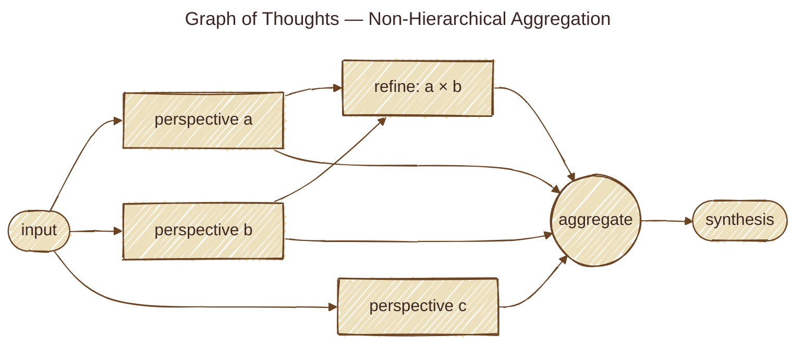

**Key benefits:** Multi-perspective analysis, thought merging, flexible reasoning paths

[**📖 Learn More →**](./reasoning/graph_of_thoughts/README.md) · [**🔎 Pi Analysis →**](./reasoning/graph_of_thoughts/pi.md)

---

### [Deep Research](./reasoning/deep_research/)
**Run iterative research loops with gap-driven follow-up queries**
```python
# Plan → Search → Read → Reflect → Follow-up → Synthesize
question → sub_queries → retrieve_sources → identify_gaps → refine_queries → cited_output
```

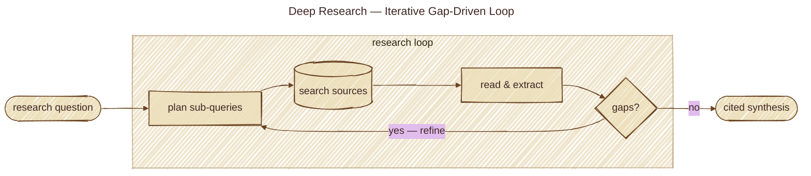

**Key benefits:** Better coverage, fewer blind spots, stronger citation quality

[**📖 Learn More →**](./reasoning/deep_research/README.md) · [**🔎 Pi Analysis →**](./reasoning/deep_research/pi.md)

---

## 🛡️ Reliability Patterns

### [Error Recovery](./reliability/error_recovery/)
**Gracefully handle failures and self-correct**
```python
# Detect → Diagnose → Recover → Verify
operation → [success | failure] → classify_error → [retry | fallback | self_correct] → verify
```

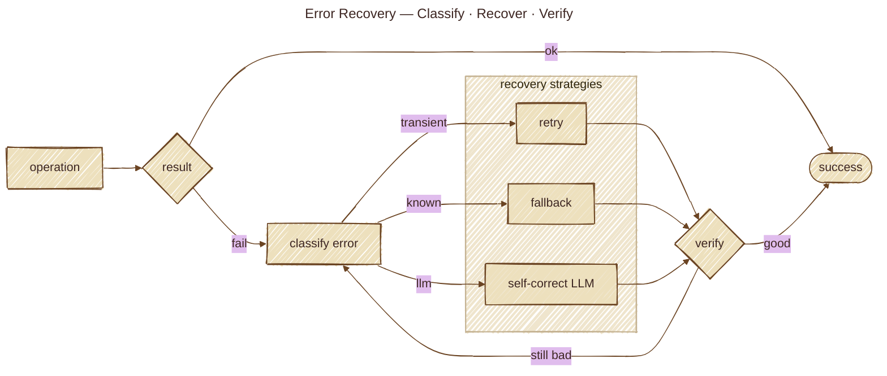

**Key benefits:** Resilience, graceful degradation, automatic self-healing, reduced downtime

[**📖 Learn More →**](./reliability/error_recovery/README.md) · [**🔎 Pi Analysis →**](./reliability/error_recovery/pi.md)

---

### [Guardrails](./reliability/guardrails/)
**Enforce safety constraints and compliance**
```python
# Multi-layer validation
input → validate → process → validate_output → [pass | block] → log
```

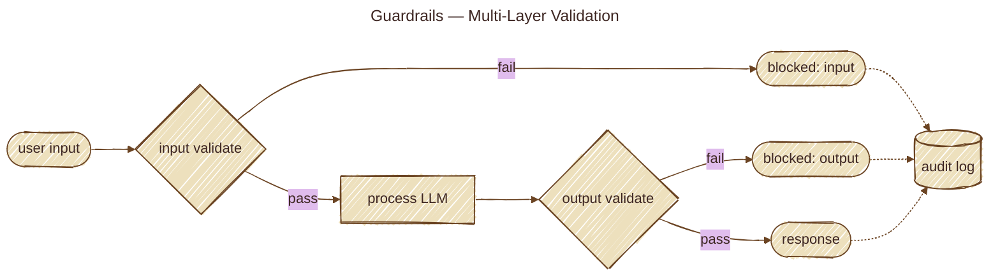

**Key benefits:** Safety assurance, compliance, brand protection, risk reduction

[**📖 Learn More →**](./reliability/guardrails/README.md) · [**🔎 Pi Analysis →**](./reliability/guardrails/pi.md)

---

## 🎯 Orchestration Patterns

### [Goal Management](./orchestration/goal_management/)
**Decompose and track complex objectives**
```python
# Hierarchical decomposition with progress tracking
complex_goal → decompose → [subgoal1, subgoal2, subgoal3] →
              track_dependencies → execute → monitor → replan
```

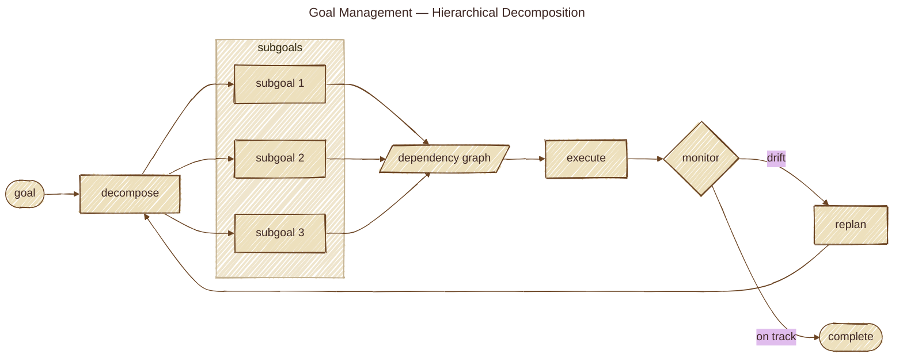

**Key benefits:** Structured execution, progress visibility, adaptive planning, resource optimization

[**📖 Learn More →**](./orchestration/goal_management/README.md) · [**🔎 Pi Analysis →**](./orchestration/goal_management/pi.md)

---

### [Subagents (Orchestrator-Worker)](./orchestration/subagents/)
**Spawn focused subagents with isolated context and structured summaries**
```python
lead_agent → decompose_task → spawn_workers_parallel → structured_summaries → synthesize
```

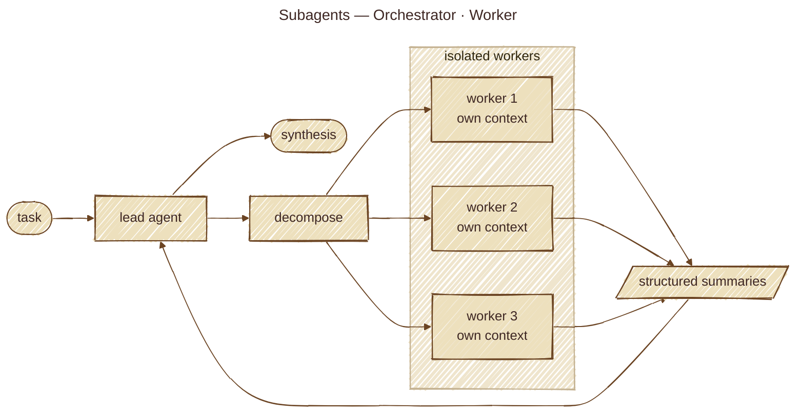

**Key benefits:** Context isolation, parallel throughput, cleaner synthesis

[**📖 Learn More →**](./orchestration/subagents/README.md) · [**🔎 Pi Analysis →**](./orchestration/subagents/pi.md)

---

### [Skills](./orchestration/skills/)
**Load capability packages on demand via metadata-first discovery**
```python
skill_catalog(metadata) → select_relevant_skill → load_SKILL_body → execute
```

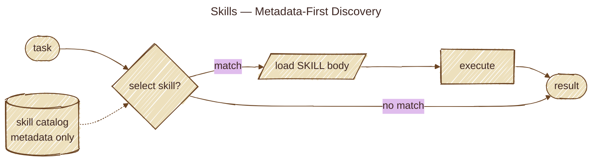

**Key benefits:** Tool-scaling beyond flat lists, lower prompt load, modular capabilities

[**📖 Learn More →**](./orchestration/skills/README.md) · [**🔎 Pi Analysis →**](./orchestration/skills/pi.md)

---

### [Agent Communication (A2A)](./orchestration/agent_communication/)
**Enable agents to coordinate through message passing**
```python
# Direct messaging, pub-sub, negotiation protocols
agent1 → message → agent2 → response → agent1
```

```mermaid
---
title: Agent Communication — Message Bus
---
%%{init: {'look':'handDrawn','theme':'base','themeVariables':{'background':'#f5ecd9','primaryColor':'#ede0bd','primaryBorderColor':'#6b4423','primaryTextColor':'#3e2723','lineColor':'#6b4423','clusterBkg':'#efe5cd','clusterBorder':'#c5b393','fontFamily':'Caveat, Patrick Hand, cursive'}}}%%
flowchart LR
    A1[agent A]
    A2[agent B]
    A3[agent C]
    Bus(((message bus<br/>direct · pub-sub)))

    A1 -- "request" --> Bus
    Bus -- "deliver" --> A2
    Bus -- "broadcast" --> A3
    A2 & A3 -- "response" --> Bus
    Bus -- "deliver" --> A1
```

**Key benefits:** Loose coupling, dynamic discovery, scalability, fault tolerance

[**📖 Learn More →**](./orchestration/agent_communication/README.md) · [**🔎 Pi Analysis →**](./orchestration/agent_communication/pi.md)

---

### [Model Context Protocol (MCP)](./orchestration/mcp/)
**Standardized tool and resource integration**
```python
# USB for AI: Standard interface for tools/data
LLM → discover_tools → invoke_tool(params) → receive_result → integrate
```

```mermaid
---
title: MCP — Model Context Protocol
---
%%{init: {'look':'handDrawn','theme':'base','themeVariables':{'background':'#f5ecd9','primaryColor':'#ede0bd','primaryBorderColor':'#6b4423','primaryTextColor':'#3e2723','lineColor':'#6b4423','clusterBkg':'#efe5cd','clusterBorder':'#c5b393','fontFamily':'Caveat, Patrick Hand, cursive'}}}%%
flowchart LR
    LLM{{LLM client}}

    subgraph servers ["MCP servers"]
        Fs[(filesystem)]
        Db[(database)]
        Ws[(web search)]
    end

    LLM -- "discover" --> Fs & Db & Ws
    LLM -- "invoke(tool, args)" --> Fs
    Fs -- "result" --> LLM
```

**Key benefits:** Standardization, reusability, interoperability, composability

[**📖 Learn More →**](./orchestration/mcp/README.md) · [**🔎 Pi Analysis →**](./orchestration/mcp/pi.md)

---

### [Prioritization](./orchestration/prioritization/)
**Optimize task ordering and resource allocation**
```python
# Multi-criteria scoring with dynamic rebalancing
tasks → score(urgency, impact, effort) → rank → schedule → execute
```

```mermaid
---
title: Prioritization — Multi-Criteria Scoring
---
%%{init: {'look':'handDrawn','theme':'base','themeVariables':{'background':'#f5ecd9','primaryColor':'#ede0bd','primaryBorderColor':'#6b4423','primaryTextColor':'#3e2723','lineColor':'#6b4423','clusterBkg':'#efe5cd','clusterBorder':'#c5b393','fontFamily':'Caveat, Patrick Hand, cursive'}}}%%
flowchart LR
    T([tasks])
    Sc[score:<br/>urgency · impact · effort]
    Rk[rank]
    Sch[schedule]
    Ex[execute]
    Rb{rebalance?}

    T --> Sc --> Rk --> Sch --> Ex --> Rb
    Rb -- "drift" --> Sc
    Rb -- "ok" --> Ex
```

**Key benefits:** Resource optimization, deadline adherence, fairness, efficiency

[**📖 Learn More →**](./orchestration/prioritization/README.md) · [**🔎 Pi Analysis →**](./orchestration/prioritization/pi.md)

---

## 📊 Observability Patterns

### [Evaluation & Monitoring](./observability/evaluation_monitoring/)
**Track performance and quality metrics**
```python
# Quantitative + qualitative metrics
operation → collect_metrics → evaluate_quality → aggregate → alert → visualize
```

```mermaid
---
title: Evaluation & Monitoring — Metrics + Quality
---
%%{init: {'look':'handDrawn','theme':'base','themeVariables':{'background':'#f5ecd9','primaryColor':'#ede0bd','primaryBorderColor':'#6b4423','primaryTextColor':'#3e2723','lineColor':'#6b4423','clusterBkg':'#efe5cd','clusterBorder':'#c5b393','fontFamily':'Caveat, Patrick Hand, cursive'}}}%%
flowchart LR
    Op[operation]

    subgraph collect ["data collection"]
        Met[(metrics)]
        Q[LLM-as-judge]
    end

    Agg[aggregate]
    Al{alert?}
    Dash([dashboard])
    Pg([page oncall])

    Op --> Met
    Op --> Q
    Met & Q --> Agg --> Al
    Al -- "ok" --> Dash
    Al -- "regression" --> Pg
```

**Key benefits:** Visibility, early detection, data-driven decisions, continuous improvement

[**📖 Learn More →**](./observability/evaluation_monitoring/README.md) · [**🔎 Pi Analysis →**](./observability/evaluation_monitoring/pi.md)

---

### [Resource Optimization](./observability/resource_optimization/)
**Reduce costs and improve performance**
```python
# Caching, batching, model routing
request → [cache_hit | cache_miss] → [cheap_model | expensive_model] → optimize
```

```mermaid
---
title: Resource Optimization — Cache + Model Routing
---
%%{init: {'look':'handDrawn','theme':'base','themeVariables':{'background':'#f5ecd9','primaryColor':'#ede0bd','primaryBorderColor':'#6b4423','primaryTextColor':'#3e2723','lineColor':'#6b4423','clusterBkg':'#efe5cd','clusterBorder':'#c5b393','fontFamily':'Caveat, Patrick Hand, cursive'}}}%%
flowchart LR
    Req([request])
    Out([response])

    Ca{cache?}
    Hit([cached])
    Cls{classify<br/>complexity}

    subgraph models ["model tier"]
        Ch[cheap: haiku]
        Ex[expensive: opus]
    end

    Req --> Ca
    Ca -- "hit" --> Hit --> Out
    Ca -- "miss" --> Cls
    Cls -- "simple" --> Ch
    Cls -- "hard" --> Ex
    Ch & Ex --> Out
```

**Key benefits:** 65-80% cost reduction, faster responses, better UX

[**📖 Learn More →**](./observability/resource_optimization/README.md) · [**🔎 Pi Analysis →**](./observability/resource_optimization/pi.md)

---

## 🧩 Memory Patterns

### [Memory Management](./memory/memory_management/)
**Maintain conversation history and long-term memory**
```python
# Buffer + semantic memory
interaction → store → [buffer_memory | vector_memory] → retrieve_relevant → use
```

```mermaid
---
title: Memory Management — Buffer + Semantic
---
%%{init: {'look':'handDrawn','theme':'base','themeVariables':{'background':'#f5ecd9','primaryColor':'#ede0bd','primaryBorderColor':'#6b4423','primaryTextColor':'#3e2723','lineColor':'#6b4423','clusterBkg':'#efe5cd','clusterBorder':'#c5b393','fontFamily':'Caveat, Patrick Hand, cursive'}}}%%
flowchart LR
    Int([interaction])
    Use([context-aware response])

    St[store]

    subgraph stores ["memory stores"]
        Bf[(buffer:<br/>recent turns)]
        Vm[(vector:<br/>semantic)]
    end

    Rt[retrieve relevant]

    Int --> St
    St --> Bf & Vm
    Bf & Vm --> Rt --> Use
```

**Key benefits:** Context retention, personalization, learning from history

[**📖 Learn More →**](./memory/memory_management/README.md) · [**🔎 Pi Analysis →**](./memory/memory_management/pi.md)

---

### [Context Management](./memory/context_management/)
**Optimize context window usage**
```python
# Dynamic selection and compression
content → score_relevance → compress → fit_window → optimize
```

```mermaid
---
title: Context Management — Score · Compress · Fit
---
%%{init: {'look':'handDrawn','theme':'base','themeVariables':{'background':'#f5ecd9','primaryColor':'#ede0bd','primaryBorderColor':'#6b4423','primaryTextColor':'#3e2723','lineColor':'#6b4423','clusterBkg':'#efe5cd','clusterBorder':'#c5b393','fontFamily':'Caveat, Patrick Hand, cursive'}}}%%
flowchart LR
    C([many docs])
    LLM{{LLM}}

    Sc[score relevance]
    Top[/top-k/]
    Cp[compress / summarize]
    Fit[/fit window/]

    C --> Sc --> Top --> Cp --> Fit --> LLM
```

**Key benefits:** 70-90% cost reduction, focused responses, better performance

[**📖 Learn More →**](./memory/context_management/README.md) · [**🔎 Pi Analysis →**](./memory/context_management/pi.md)

---

## 🎓 Learning Patterns

### [Adaptive Learning](./learning/adaptive_learning/)
**Improve through feedback and continuous learning**
```python
# Learn from outcomes
action → feedback → analyze_patterns → adapt_strategy → improve
```

```mermaid
---
title: Adaptive Learning — Feedback Loop
---
%%{init: {'look':'handDrawn','theme':'base','themeVariables':{'background':'#f5ecd9','primaryColor':'#ede0bd','primaryBorderColor':'#6b4423','primaryTextColor':'#3e2723','lineColor':'#6b4423','clusterBkg':'#efe5cd','clusterBorder':'#c5b393','fontFamily':'Caveat, Patrick Hand, cursive'}}}%%
flowchart LR
    Ac([action])
    Im([improved policy])

    Fb[/feedback:<br/>reward · critique/]
    An[analyze patterns]
    St[update strategy]

    Ac --> Fb --> An --> St --> Im
    Im -. "next action" .-> Ac
```

**Key benefits:** Continuous improvement, personalization, domain adaptation

[**📖 Learn More →**](./learning/adaptive_learning/README.md) · [**🔎 Pi Analysis →**](./learning/adaptive_learning/pi.md)

---

## 🚀 Quick Start

### Prerequisites
```bash
# Python 3.11 or higher
python --version

# Install uv 
curl -LsSf https://astral.sh/uv/install.sh | sh
```

### Installation
```bash
# Clone the repository
git clone https://github.com/gtesei/agentic_design_patterns.git
cd agentic_design_patterns

# Set up shared environment
echo "OPENAI_API_KEY=your_api_key_here" > .env
```

### Repository Runtime Notes

- The repository requires **Python 3.11+**.
- Each pattern folder has its own `pyproject.toml`, so run `uv sync` inside the pattern you want to execute.
- Example scripts now use a shared bootstrap helper in `repo_support.py` to:
  - locate the repo root
  - load the root `.env`
  - make the repo importable from any pattern folder
- Set `OPENAI_MODEL` in your environment if you want to override the default example model:

```bash
export OPENAI_MODEL=gpt-4o-mini
```

- If you are behind a corporate SSL interception proxy, SSL bypass is now **opt-in**:

```bash
export AGENTIC_DISABLE_SSL=1
```

### Run Your First Pattern

Python remains the canonical track. All current foundational patterns also include a Bun/TypeScript port under `<pattern>/typescript/`.

```bash
# Python
cd foundational_design_patterns/3_parallelization
[uv sync]
uv run python src/parallelization.py

# TypeScript
cd foundational_design_patterns/3_parallelization/typescript
[bun install]
bash run.sh
```

Foundational patterns with both Python and TypeScript implementations currently live under:

- `foundational_design_patterns/1_prompt_chain`
- `foundational_design_patterns/2_routing`
- `foundational_design_patterns/3_parallelization`
- `foundational_design_patterns/4_reflection`
- `foundational_design_patterns/5_tool_use`
- `foundational_design_patterns/6_planning`
- `foundational_design_patterns/7_multi_agent_collaboration`
- `foundational_design_patterns/8_react`
- `foundational_design_patterns/9_rag`
- `foundational_design_patterns/10_hitl`
- `foundational_design_patterns/11_structured_outputs`
- `foundational_design_patterns/12_computer_use`

For TypeScript workspace conventions, coverage, and runtime details, see [typescript_base/TYPESCRIPT.md](./typescript_base/TYPESCRIPT.md).

### Reliability And Smoke Tests

Use these from the repo root:

```bash
# Python foundational offline smoke
bash scripts/run_demos_smoke.sh --mode basic

# TypeScript foundational offline smoke
bash scripts/run_demos_smoke_typescript.sh --mode basic
```

### CI

GitHub Actions runs the reliability gate on pushes and pull requests:

- `.github/workflows/reliability-gate.yml`
- Python shared-runtime smoke via `unittest`
- foundational TypeScript type-checks via `bun --bun tsc --noEmit`
- foundational TypeScript offline smoke via `scripts/run_demos_smoke_typescript.sh --mode basic`

---

## 🗺️ Pattern Selection Guide

### Choose Your Pattern Based on Your Needs:

**Need speed?** → **Routing** + **Parallelization** + **Resource Optimization** (caching, batching)

**Need quality?** → **Reflection** + **RAG** (grounded knowledge) + **Evaluation & Monitoring**

**Need cost optimization?** → **Routing** + **Resource Optimization** (65-80% savings) + **Context Management**

**Need both speed AND quality?** → **Parallelization** + **Prompt Chaining** + **RAG**

**Complex multi-step workflow?** → **Prompt Chaining** + **Planning** + **Goal Management**

**Independent concurrent tasks?** → **Parallelization** will give you massive speedups

**High-stakes output?** → **Reflection** + **HITL** (human approval) + **Guardrails** (safety)

**External system integration?** → **Tool Use** + **MCP** (standardized protocols)

**Multi-step automation?** → **Planning** + **Goal Management** + **Agent Communication**

**Multiple roles working together?** → **Multi-Agent Collaboration** + **Agent Communication** (A2A)

**Exploratory multi-step tasks?** → **ReAct** (reasoning + actions) or **Tree of Thoughts** (exploration)

**Need transparent decision-making?** → **ReAct** (explicit reasoning) + **Evaluation & Monitoring**

**Need strict machine-readable outputs?** → **Structured Outputs** + **Guardrails**

**Need UI/browser automation?** → **Computer Use** + **HITL**

**Need iterative cited synthesis?** → **Deep Research** + **RAG**

**Need scalable multi-capability agents?** → **Subagents** + **Skills**

**Knowledge-grounded responses?** → **RAG** retrieves relevant documents before generation

**Complex reasoning tasks?** → **Tree of Thoughts** (systematic) or **Graph of Thoughts** (multi-perspective)

**Production reliability?** → **Error Recovery** + **Guardrails** + **Evaluation & Monitoring**

**Long conversations?** → **Memory Management** + **Context Management** (optimize windows)

**Continuous improvement?** → **Adaptive Learning** + **Evaluation & Monitoring** (feedback loops)

**Resource constraints?** → **Prioritization** + **Resource Optimization** + **Context Management**


---

## 🎓 Learning Path

### Beginner → Intermediate → Advanced → Expert

**Phase 1: Foundations (Start Here)**
1. [Prompt Chaining](./foundational_design_patterns/1_prompt_chain/) - Foundation for everything
2. [Routing](./foundational_design_patterns/2_routing/) - Learn to optimize model selection
3. [Parallelization](./foundational_design_patterns/3_parallelization/) - Scale your applications
4. [Reflection](./foundational_design_patterns/4_reflection/) - Master quality optimization
5. [Tool Use](./foundational_design_patterns/5_tool_use/) - Connect to external systems

**Phase 2: Core Patterns**
6. [RAG](./foundational_design_patterns/9_rag/) - Knowledge-grounded responses
7. [ReAct](./foundational_design_patterns/8_react/) - Reasoning + acting
8. [Planning](./foundational_design_patterns/6_planning/) - Strategic decomposition
9. [HITL](./foundational_design_patterns/10_hitl/) - Human oversight
10. [Multi-Agent](./foundational_design_patterns/7_multi_agent_collaboration/) - Agent coordination

**Phase 3: Advanced Reasoning**
11. [Tree of Thoughts](./reasoning/tree_of_thoughts/) - Systematic exploration
12. [Graph of Thoughts](./reasoning/graph_of_thoughts/) - Multi-perspective reasoning

**Phase 4: Production Patterns**
13. [Error Recovery](./reliability/error_recovery/) - Resilience
14. [Guardrails](./reliability/guardrails/) - Safety
15. [Evaluation & Monitoring](./observability/evaluation_monitoring/) - Metrics
16. [Resource Optimization](./observability/resource_optimization/) - Cost/performance

**Phase 5: Orchestration & Memory**
17. [Goal Management](./orchestration/goal_management/) - Objective tracking
18. [Agent Communication](./orchestration/agent_communication/) - Messaging
19. [MCP](./orchestration/mcp/) - Standardized integration
20. [Prioritization](./orchestration/prioritization/) - Task ranking
21. [Memory Management](./memory/memory_management/) - Context retention
22. [Context Management](./memory/context_management/) - Optimization

**Phase 6: Continuous Improvement**
23. [Adaptive Learning](./learning/adaptive_learning/) - Learning from feedback
24. [Structured Outputs](./foundational_design_patterns/11_structured_outputs/) - Schema reliability
25. [Computer Use](./foundational_design_patterns/12_computer_use/) - Browser/UI automation
26. [Subagents](./orchestration/subagents/) - Orchestrator-worker topology
27. [Skills](./orchestration/skills/) - Capability packages
28. [Deep Research](./reasoning/deep_research/) - Iterative research loops

Each pattern builds on concepts from previous ones. Start with Phase 1, then explore other phases based on your needs.

---

## 🛠️ Tech Stack

### Core Frameworks
- **[LangChain](https://python.langchain.com/)** - Comprehensive framework for LLM applications
- **[LangGraph](https://langchain-ai.github.io/langgraph/)** - Stateful workflows and multi-agent orchestration
- **[LangSmith](https://smith.langchain.com/)** - LLM application monitoring and evaluation

### Models & APIs
- **[OpenAI Models](https://openai.com/)** - Primary provider used throughout the examples, configured via environment variables
- **[Anthropic Claude](https://anthropic.com/)** - Alternative frontier-model family with strong long-context support
- **[Other LLM Providers](https://python.langchain.com/docs/integrations/llms/)** - Fully compatible through LangChain abstractions

### Development Tools
- **[Pydantic](https://docs.pydantic.dev/)** - Data validation and structured outputs
- **[Python 3.11+](https://www.python.org/)** - Modern Python features (match/case, typing)
- **[uv](https://github.com/astral-sh/uv)** - Fast Python package manager

### Observability & Evaluation
- **[W&B Weave](https://wandb.ai/site/weave/)** - Agent evaluation and monitoring
- **[LangSmith](https://smith.langchain.com/)** - Tracing and debugging

---


## 📖 Resources

### 🎓 Academic Papers & Surveys

**Reasoning & Planning:**
- [ReAct: Synergizing Reasoning and Acting in Language Models](https://arxiv.org/abs/2210.03629) (Yao et al., 2022) - ICLR 2023
- [Tree of Thoughts: Deliberate Problem Solving with Large Language Models](https://arxiv.org/abs/2305.10601) (Yao et al., 2023) - NeurIPS 2023
- [Graph of Thoughts: Solving Elaborate Problems with Large Language Models](https://arxiv.org/abs/2308.09687) (Besta et al., 2023)

**Retrieval-Augmented Generation:**
- [Agentic Retrieval-Augmented Generation: A Survey on Agentic RAG](https://arxiv.org/abs/2501.09136) (Singh et al., 2025)
- [Retrieval-Augmented Generation for Knowledge-Intensive NLP Tasks](https://arxiv.org/abs/2005.11401) (Lewis et al., 2020)

### 📚 Books

- **[Agentic Design Patterns: A Hands-On Guide to Building Intelligent Systems](https://link.springer.com/book/10.1007/978-3-031-87617-1)** - Antonio Gullí (Springer Nature, 2024) - Primary inspiration for this repository
- **[Building LLM Powered Applications](https://www.oreilly.com/library/view/building-llm-powered/9781835462317/)** - Valentina Alto (Packt/O'Reilly, 2024)
- **[Hands-On Large Language Models](https://www.oreilly.com/library/view/hands-on-large/9781098150952/)** - Jay Alammar & Maarten Grootendorst (O'Reilly, 2024)

### 🎓 Courses & Educational Content

**Foundational Courses:**
- **[Agentic AI with Andrew Ng](https://www.deeplearning.ai/courses/agentic-ai/)** (DeepLearning.AI, 2024) - Covers reflection, tool use, planning, and multi-agent collaboration

**Framework-Specific:**
- [LangChain Academy](https://academy.langchain.com/) - Official LangChain courses
- [LangGraph Tutorials](https://langchain-ai.github.io/langgraph/tutorials/) - Stateful agent workflows
- [OpenAI Cookbook](https://cookbook.openai.com/) - Function calling and agent patterns
- [Anthropic Prompt Engineering Interactive Tutorial](https://github.com/anthropics/prompt-eng-interactive-tutorial)

### 🏭 Industry Documentation & Guides

**Official Framework Documentation:**
- [LangChain Documentation](https://python.langchain.com/docs/get_started/introduction)
- [LangGraph Documentation](https://langchain-ai.github.io/langgraph/)
- [Microsoft AutoGen](https://microsoft.github.io/autogen/stable/)
- [OpenAI Function Calling Guide](https://platform.openai.com/docs/guides/function-calling)
- [OpenAI Agents Platform](https://platform.openai.com/docs/guides/agents)
- [Anthropic Prompt Engineering Guide](https://docs.anthropic.com/en/docs/build-with-claude/prompt-engineering/overview)

**Production Best Practices:**
- [LangChain: Top 5 LangGraph Agents in Production 2024](https://www.blog.langchain.com/top-5-langgraph-agents-in-production-2024/) - Real-world deployments
- [Weights & Biases: Agentic RAG Guide](https://wandb.ai/byyoung3/Generative-AI/reports/Agentic-RAG-Enhancing-retrieval-augmented-generation-with-AI-agents--VmlldzoxMTcyNjQ5Ng)

### 🌐 Community Resources

**Curated Collections:**
- [Awesome-LangGraph](https://github.com/von-development/awesome-LangGraph) - Comprehensive LangGraph ecosystem index
- [Prompt Engineering Guide](https://www.promptingguide.ai/) - Comprehensive guide covering latest papers and techniques
- [Learn Prompting](https://learnprompting.org/) - Free generative AI guide

**Related Projects:**
- [LangChain Templates](https://github.com/langchain-ai/langchain/tree/master/templates)
- [Microsoft AutoGen](https://github.com/microsoft/autogen)
- [CrewAI](https://github.com/joaomdmoura/crewAI)
- [AG2 (formerly AutoGen)](https://github.com/ag2ai/ag2)

### 🔬 Research Collections

- [Papers with Code: Agents](https://paperswithcode.com/task/agents) - Latest research with implementations
- [arXiv: Artificial Intelligence](https://arxiv.org/list/cs.AI/recent) - Recent AI papers
- [Hugging Face Papers](https://huggingface.co/papers) - Trending ML research

---

## 🏛️ Standards & Compliance

### NIST AI Risk Management Framework

Organizations deploying agentic AI systems should consider the NIST AI Risk Management Framework and associated guidance:

#### **Core Framework**
- **[NIST AI Risk Management Framework (AI RMF 1.0)](https://www.nist.gov/itl/ai-risk-management-framework)** (January 2023)
  Voluntary framework to manage AI risks based on four core functions: Govern, Map, Measure, and Manage.

#### **Generative AI Profile**
- **[NIST AI RMF: Generative AI Profile (NIST.AI.600-1)](https://www.nist.gov/publications/artificial-intelligence-risk-management-framework-generative-artificial-intelligence)** (July 2024)
  Addresses risks unique to Generative AI, including governance, content provenance, pre-deployment testing, and incident disclosure. Includes catalog of 400+ mitigation actions.

### Compliance Mapping

| NIST AI RMF Function | Relevant Patterns |
|---------------------|-------------------|
| **Govern** | [Human-in-the-Loop](./foundational_design_patterns/10_hitl/), [Guardrails](./reliability/guardrails/) |
| **Map** | [Planning](./foundational_design_patterns/6_planning/), [Goal Management](./orchestration/goal_management/) |
| **Measure** | [Evaluation & Monitoring](./observability/evaluation_monitoring/), [Adaptive Learning](./learning/adaptive_learning/) |
| **Manage** | [Error Recovery](./reliability/error_recovery/), [Guardrails](./reliability/guardrails/) |

### Key Focus Areas for Agentic Systems

- **Transparency:** ReAct pattern provides explicit reasoning traces for auditability
- **Human Oversight:** HITL pattern enables approval workflows
- **Safety Constraints:** Guardrails pattern enforces compliance boundaries
- **Evaluation:** Monitoring pattern tracks quality and bias metrics
- **Error Recovery:** Graceful degradation and incident response

### Additional Resources

- [AI Executive Order 14110](https://www.whitehouse.gov/briefing-room/presidential-actions/2023/10/30/executive-order-on-the-safe-secure-and-trustworthy-development-and-use-of-artificial-intelligence/)
- [EU AI Act](https://artificialintelligenceact.eu/)
- [ISO/IEC 42001:2023](https://www.iso.org/standard/81230.html) - AI Management System standard

---

## 📄 License

This project is licensed under the MIT License - see the [LICENSE](./LICENSE) file for details.

---

## 📌 How to Cite

If you reference this catalog in academic or professional work, please cite:

```bibtex
@misc{tesei_agentic_design_patterns,
  author       = {Tesei, Gino},
  title        = {Agentic Design Patterns: A Hands-On Catalog for Building Intelligent Systems},
  year         = {2024},
  publisher    = {GitHub},
  howpublished = {\url{https://github.com/gtesei/agentic_design_patterns}},
  note         = {MIT License}
}
```

---

## 🙏 Acknowledgments

This repository's structure and approach were inspired by:

### Primary References

> **Gullí, Antonio**, *Agentic Design Patterns: A Hands-On Guide to Building Intelligent Systems*, Springer Nature Switzerland, 2024.

> **Ng, Andrew**, *Agentic AI*, DeepLearning.AI, 2024.

### Academic Foundations

We gratefully acknowledge the research contributions that ground these patterns:

- **Yao, Shunyu et al.** - ReAct and Tree of Thoughts frameworks
- **Singh, Aditi et al.** - Agentic RAG survey and taxonomy
- **Besta, Maciej et al.** - Graph of Thoughts methodology
- **Lewis, Patrick et al.** - Foundational RAG research

### Community & Tools

Special thanks to:
- The **LangChain and LangGraph teams** for building production-grade agentic frameworks
- The **open-source AI community** for advancing the state of the art
- **NIST** for providing guidance on trustworthy AI development
- **[Claude Code](https://claude.ai/)** for assistance in developing and refining the implementations in this repository
- All **contributors** who help improve these patterns

---

## ⭐ Star History

If you find this repository helpful, please consider giving it a star! It helps others discover these patterns.

[](https://star-history.com/#gtesei/agentic_design_patterns&Date)
---

<div align="center">

**Built with ❤️ for the AI developer community**

[⬆ Back to Top](#-agentic-design-patterns)

</div>
