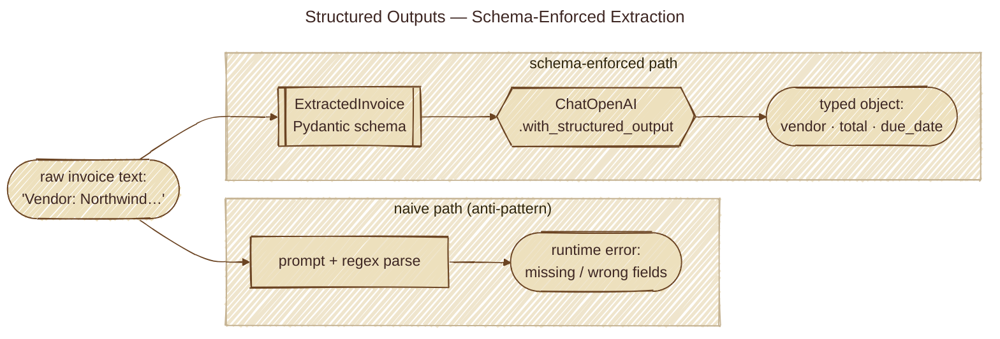

# Structured Outputs Pattern

## Overview

The **Structured Outputs Pattern** treats schema-constrained output as a **core reliability primitive** — not a convenience. Instead of asking the LLM for prose and then parsing it with regex or "if `json.loads` fails, retry", you declare the output shape (Pydantic / TypeBox / JSON Schema) and the framework enforces it before the value ever reaches your code.

The pattern shifts validation from a brittle post-hoc step to a contract the model has to satisfy, surfacing malformed output as a typed validation error rather than a silent corruption downstream.

## Architecture



## How It Works

1. **Declare the schema**: define the desired output as a Pydantic / TypeBox / Zod model. This is the single source of truth.
2. **Bind it to the call**: use the framework's structured-output API (`with_structured_output(Model)`, `response_format=Model`, `generateObject({ schema })`) or expose it as a tool whose `parameters` is the schema.
3. **Model emits typed output**: providers translate the schema into a JSON Schema sent alongside the prompt; many providers also enforce it at the decoding layer.
4. **Validate at the boundary**: the framework runs schema validation before returning to the caller. Failures are typed errors, not corrupt data.
5. **(Optional) retry with the error inline**: tools like Instructor catch the validation error and re-prompt the model with the validator's complaint as feedback.

### Three structured-output surfaces

| Surface                | What it constrains                       | Typical API |
|---|---|---|
| Structured *tool input* | Model's arguments to a function call     | `tool(args_schema=Model)` / `parameters: Type.Object({...})` |
| Structured *final answer* | The end-of-turn payload the user wants  | `with_structured_output(Model)` / `generateObject({ schema })` |
| Structured *event transport* | Machine-readable agent-loop events | `--mode json` / streaming SSE with typed events |

### Example: ad-hoc parsing vs schema-constrained

```
Ad-hoc (fragile):
  prompt: "Return a JSON list of action items"
  → model emits "```json\n[\"…\", \"…\"]\n```" — sometimes
  → regex / strip code fences / json.loads / hope for the best

Schema-constrained:
  class Actions(BaseModel): items: list[str]
  llm.with_structured_output(Actions).invoke(prompt)
  → returns Actions(items=[...]) or raises ValidationError
```

## Key Benefits

- **Reliability**: shape failures surface as typed errors at one well-defined boundary, not as silent corruption five layers downstream.
- **One source of truth**: schema doubles as the LLM-facing JSON Schema *and* the in-process static type — no `zod-to-json-schema` drift.
- **Auditability**: malformed outputs are recorded as validation failures with field-level reasons, not as opaque "the model was weird today" log noise.
- **Composability**: typed outputs from one step are typed inputs to the next — chainable without manual marshalling.
- **Retry-with-feedback**: Instructor-style retries can inline the validator's complaint into the next prompt, dramatically improving success rates on the second try.

## When to Use This Pattern

**Rule of Thumb**: Use Structured Outputs whenever an LLM response will be **consumed by code, not just shown to a human**. The moment you start writing parsing logic, you've already lost.

### Ideal Use Cases

- **Extraction**: pulling typed entities (names, dates, amounts) out of unstructured text.
- **Classification with confidence**: returning `{ label: enum, confidence: float, rationale: str }`.
- **Agent plans**: a typed list of steps, each with `tool`, `args`, `rationale`.
- **Routing decisions**: a typed enum picking which downstream handler to call.
- **Tool inputs**: every function-calling tool already does this — make it explicit.
- **Multi-step pipelines**: where output(N) feeds input(N+1) and shape drift would propagate.

### When NOT to Use

- Free-form conversational replies where prose *is* the deliverable.
- Streaming UX where partial tokens matter more than a complete validated object.
- One-off prototyping where the schema cost outweighs the savings.

## Implementation Considerations

- **TypeBox vs Zod vs Pydantic**: pick the one whose JSON-Schema generation is cheapest at runtime. TypeBox is JSON-Schema-native; Zod requires a conversion step.
- **Strict vs lenient schemas**: provider "strict" modes reject extra fields — useful for security but punishing on schema evolution. Default to permissive on inputs, strict on outputs.
- **Retry policy**: if a provider can't satisfy the schema, will you retry, fall back to free-form + parsing, or surface the failure? Decide before you ship.
- **Token budget**: the schema is sent on every call. Trim descriptions and avoid deeply nested optional fields.
- **Termination semantics**: when structured output *is* the final answer, you want the model to return the typed object and **stop** — design the API so emitting the schema is end-of-turn (e.g., `terminate: true` on the tool result, or `generateObject` semantics).
- **Schema versioning**: long-running pipelines need a story for when the schema changes mid-flight. Version the schema and migrate, don't silently mutate.

## Example Architecture

```
                    ┌──────────────────────────┐
   user prompt ───►│  LLM call with schema     │
                    │  - prompt + JSON Schema   │
                    │  - provider strict-mode?  │
                    └─────────────┬─────────────┘
                                  │ raw JSON
                                  ▼
                       ┌──────────────────────┐
                       │   Validator (Pydantic │
                       │   / TypeBox / Zod)   │
                       └─────────┬────────────┘
                                  │
                ┌────────────────┴─────────────┐
                ▼                              ▼
        Typed object                  ValidationError
        (handed to caller)            ├─ retry with feedback
                                      ├─ fallback parser
                                      └─ surface to user
```

## Related Patterns

- **Tool Use**: every tool call is a structured-input problem — same primitive, different framing.
- **Routing**: a typed `Literal["a", "b", "c"]` output is the cleanest router decision.
- **Reflection**: the critic's verdict is a perfect structured-output target (`{ pass: bool, issues: list[str] }`).
- **Error Recovery**: validation errors are first-class retry signals.

## Demos in this directory

- `src/structured_outputs_basic.py`: naive prompt parsing vs `with_structured_output(PydanticModel)`.
- `src/structured_outputs_advanced.py`: Instructor retries + malformed-input failure mode.

Run:

```bash
uv sync
bash run.sh
```

## Corporate SSL proxy note

If you're behind a corporate SSL-inspecting proxy, run examples with:

```bash
AGENTIC_DISABLE_SSL=1 bash run.sh
```

---

*If a downstream consumer is code, the output should be typed. Prose-then-regex is technical debt.*
