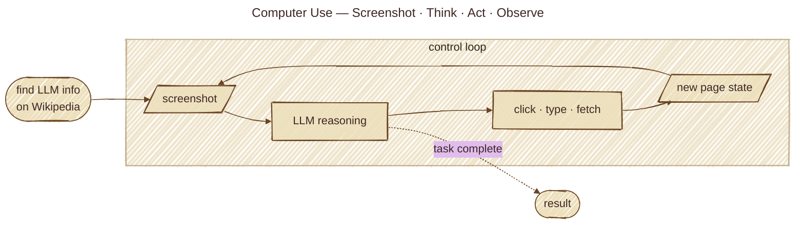

# Computer Use Pattern

Browser/UI automation framing with explicit safety policy.

## Architecture



- `src/computer_use_basic.py`: screenshot-think-act-observe simulation on Wikipedia
- `src/computer_use_advanced.py`: optional Playwright execution + safety controls

Run:

```bash
uv sync
bash run.sh
```

If you're behind a corporate SSL-inspecting proxy:

```bash
AGENTIC_DISABLE_SSL=1 bash run.sh
```
