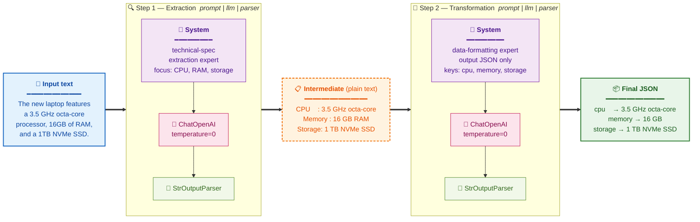
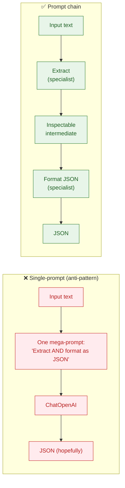

# Prompt Chaining Pattern

## Overview

**Prompt Chaining** (also known as the **Pipeline Pattern**) breaks down complex tasks into a sequence of smaller, focused steps. Each step involves an LLM call or processing logic, using the output of the previous step as input for the next.

This pattern improves the reliability, transparency, and manageability of complex interactions with language models by applying a "divide-and-conquer" approach.

## How It Works
```
Input → Step 1 (LLM/Logic) → Step 2 (LLM/Logic) → Step 3 (LLM/Logic) → Final Output
         ↓                    ↓                    ↓
      Intermediate         Intermediate         Intermediate
        Output              Output               Output
```

### This demo's chain (laptop spec → JSON)



#### Why two LLM calls instead of one?



The intermediate plain-text extraction is **inspectable** — when the final JSON is wrong, you can tell whether extraction or formatting broke. LCEL composition mirrors the diagram: `prompt | llm | parser` for each step, with the first step's output piped in as `{"specifications": extraction_chain}` to the second step's prompt ([`src/chain_prompt.py:107-130`](src/chain_prompt.py)).

Each step in the chain:
1. **Receives input** from the previous step (or user)
2. **Processes** the input through an LLM call or logic function
3. **Produces output** that becomes input for the next step
4. **Maintains context** by passing relevant information forward

## Key Benefits

### 🎯 **Improved Reliability**
- Focuses the model on one specific operation at a time
- Reduces complexity and potential for errors
- Easier to debug when issues occur

### 🔍 **Enhanced Transparency**
- Clear visibility into each processing step
- Intermediate outputs can be inspected and validated
- Makes the reasoning process explicit

### 🛠️ **Better Control**
- Fine-tune individual steps independently
- Insert validation logic between steps
- Modify or extend the pipeline without rebuilding from scratch

### 🔄 **Flexibility**
- Mix LLM calls with traditional processing logic
- Conditional branching based on intermediate results
- Easy to A/B test different step implementations

## When to Use This Pattern

### ✅ Ideal Use Cases

- **Multi-step reasoning**: Tasks requiring sequential logical steps
- **Document processing**: Extract → Analyze → Summarize → Format
- **Content generation**: Research → Outline → Draft → Edit → Polish
- **Data transformation**: Parse → Validate → Transform → Enrich → Output
- **Complex decision-making**: Gather context → Analyze options → Make recommendation
- **Quality assurance**: Generate → Critique → Revise → Validate

### ❌ When NOT to Use

- Simple, single-step tasks that don't benefit from decomposition
- Real-time applications where latency from multiple LLM calls is prohibitive
- Tasks where context from all steps must be processed simultaneously
- Highly iterative workflows better suited for agent-based patterns

## Implementation Frameworks

Modern frameworks provide robust tools for building prompt chains:

- **LangChain/LangGraph**: Python-based framework with extensive chain primitives
- **Google ADK (Agent Development Kit)**: Google's agent building toolkit
- **Haystack**: NLP framework with pipeline support
- **Semantic Kernel**: Microsoft's SDK for AI orchestration

### Simple Implementation Example
```python
# Conceptual example
def research_step(topic):
    return llm.generate(f"Research key facts about: {topic}")

def outline_step(research):
    return llm.generate(f"Create an outline based on: {research}")

def draft_step(outline):
    return llm.generate(f"Write a draft following: {outline}")

# Chain execution
topic = "Artificial Intelligence"
research = research_step(topic)
outline = outline_step(research)
final_draft = draft_step(outline)
```

## Design Considerations

### State Management
- **Stateless chains**: Each step is independent (easier to scale)
- **Stateful chains**: Maintain context across steps (more flexible)

### Error Handling
- Implement retry logic for failed LLM calls
- Provide fallback strategies for individual steps
- Validate outputs between steps

### Performance Optimization
- Cache intermediate results where appropriate
- Run independent steps in parallel when possible
- Consider batch processing for similar chains

### Monitoring & Debugging
- Log input/output for each step
- Track execution time per step
- Monitor token usage across the chain

## Advanced Patterns

### Conditional Chaining
Execute different steps based on intermediate results:
```
Input → Classify → [Route A: Steps 1-3] or [Route B: Steps 4-6] → Output
```

### Iterative Refinement
Loop back to earlier steps for quality improvement:
```
Draft → Critique → [Good? → Output] or [Poor? → Revise → Critique]
```

### Parallel Chains
Execute multiple chains simultaneously and merge results:
```
Input → [Chain A] → Merge → Output
     → [Chain B] →
     → [Chain C] →
```

## Best Practices

1. **Keep steps focused**: Each step should have a single, clear purpose
2. **Design for observability**: Make intermediate outputs inspectable
3. **Validate aggressively**: Check outputs between steps
4. **Plan for failure**: Implement graceful degradation
5. **Document the flow**: Make the chain's logic explicit and maintainable
6. **Test incrementally**: Validate each step before adding the next
7. **Consider cost**: Balance chain length with API token usage

## Conclusion

Prompt chaining provides a foundational pattern for building sophisticated AI systems that go far beyond single-prompt capabilities. By deconstructing complex problems into manageable sub-tasks, this approach:

- **Enhances reliability** through focused, single-purpose operations
- **Improves control** over model behavior and output quality
- **Enables complexity** through composition of simple building blocks
- **Supports maintainability** with modular, testable components

This "divide-and-conquer" strategy is essential for developing robust, context-aware AI agents capable of multi-step reasoning, tool integration, and state management. Mastering prompt chaining is crucial for building production-grade systems that can execute intricate workflows with consistency and reliability.

## Related Patterns

- **Routing**: For conditional branching between different chains
- **ReAct**: For interleaving reasoning and actions within chains
- **Orchestration**: For coordinating multiple parallel chains
- **Tool Use**: For integrating external capabilities into chain steps

---

*Prompt chaining transforms complex AI tasks from monolithic operations into manageable, reliable pipelines.*

## Corporate SSL proxy note

If you're behind a corporate SSL-inspecting proxy, run examples with:

```bash
AGENTIC_DISABLE_SSL=1 bash run.sh
```

