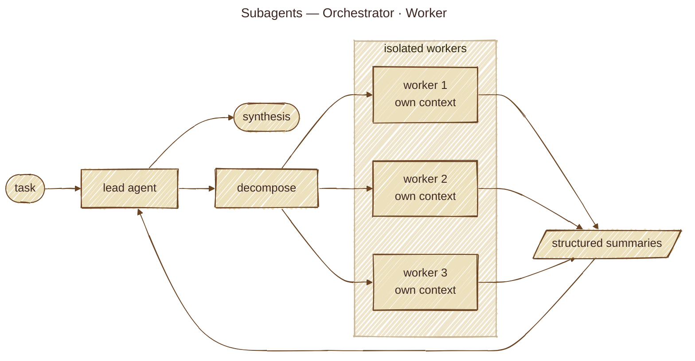

# Subagents Pattern (Orchestrator-Worker)

## Overview

The **Subagents Pattern** lets a primary agent delegate work to **specialized worker agents that run in isolated contexts** and return structured summaries instead of raw transcripts. The orchestrator decides *what* needs to happen; each worker decides *how* within a narrowly scoped role (scout, planner, reviewer, worker, etc.).

The contract is "summary, not raw transcript": the worker's intermediate reasoning, tool calls, and partial outputs stay in its own context window, and only a structured result crosses back to the orchestrator. That isolation is what makes this pattern scale to long-horizon tasks without overflowing the orchestrator's context.

## Architecture



## How It Works

1. **Define worker roles**: each role is a system prompt + optional model + optional tool allowlist (a "scout", a "reviewer", etc.). Roles are usually markdown files with frontmatter.
2. **Orchestrator decomposes the task** into one or more subagent invocations.
3. **Spawn workers in isolated contexts**: each worker boots fresh — its own message history, its own system prompt — with no access to the orchestrator's transcript.
4. **Workers run their playbook** and produce a **structured summary** following the format prescribed by their role.
5. **Orchestrator receives summaries** as tool results and decides what to do next: synthesize, run another wave, or finish.

### Three orchestration modes

```
single      ┌───────────┐                     ┌──────────────┐
            │ Orchestr. │ ───── task ─────►   │   Worker     │ ─── summary ───►  orchestrator
            └───────────┘                     └──────────────┘

parallel    ┌───────────┐ ──► [Worker A] ─┐
            │ Orchestr. │ ──► [Worker B] ─┼─► [synth] ─► orchestrator
            └───────────┘ ──► [Worker C] ─┘

chain       ┌───────────┐ → [Worker A] → {previous} → [Worker B] → {previous} → [Worker C] → orchestrator
            └───────────┘
```

- **single**: one task → one worker → one summary back.
- **parallel**: N independent tasks → up to K workers concurrent → N summaries back.
- **chain**: sequential handoff where each worker sees only the previous worker's structured summary (not its full transcript).

### Why process / context isolation matters

- The orchestrator's context window is the bottleneck — keep it focused on **deciding**, not on **doing**.
- A worker can use 20k tokens of tool output internally and still hand back a 200-token summary.
- A failure in one worker doesn't corrupt the orchestrator's reasoning chain.

## Key Benefits

- **Context budget**: workers absorb the heavy reading; orchestrator stays focused.
- **Specialization**: each role has a tuned system prompt, model, and tool allowlist — no one-prompt-fits-all compromise.
- **Parallelism**: independent sub-tasks fan out and rejoin without manual concurrency plumbing.
- **Composability**: roles are markdown files — you can ship, share, and version them like skills.
- **Fault isolation**: a worker crashing or misbehaving fails one branch, not the whole run.

## When to Use This Pattern

**Rule of Thumb**: Use Subagents when a task has **distinct sub-tasks that benefit from different context, different prompts, or independent parallelism** — and when keeping the orchestrator's context lean matters more than minimizing latency.

### Ideal Use Cases

- **Implement-and-review loops**: worker writes code → reviewer critiques → worker fixes (the basic shape of the Reflection pattern, but with two distinct contexts).
- **Scout-and-plan workflows**: scout explores a codebase / corpus → planner produces a plan that fits in the orchestrator's prompt.
- **Parallel evaluation**: fan out N candidates to N workers; synthesize the winner.
- **Multi-source research**: each worker investigates one domain in isolation and reports back.
- **Heavyweight reads**: a single worker can summarize 50 files and return one paragraph.

### When NOT to Use

- Single-purpose, single-context tasks — the spawn overhead isn't worth it.
- Tight feedback loops where the orchestrator needs to see worker intermediate state (subagents are summary-only by design).
- Real-time / streaming UX where multi-second worker spin-up breaks the interaction flow.
- Cases where shared mutable state is fundamental — subagents communicate via messages, not shared memory.

## Implementation Considerations

- **Isolation strength**: in-process (cheap, shared runtime), separate-process (medium cost, OS-level isolation), separate-container (high cost, strong isolation). Pick what the threat model and latency budget allow.
- **Result contract**: every role's system prompt should prescribe the **output format** (`## Completed`, `## Files Changed`, `## Notes`). The orchestrator pastes this back verbatim — drift in the format breaks downstream parsing.
- **Concurrency caps**: parallel mode needs both a *queue cap* (max items per invocation) and a *concurrency cap* (max running at once). Hardcode sensible defaults — 4 / 8 is a reasonable starting point.
- **Chain handoff**: pass only the structured summary, not the worker's full transcript. A `{previous}` placeholder is enough — resist the temptation to invent a shared blackboard.
- **Security**: project-controlled subagent definitions (`.repo/agents/*.md`) can inject arbitrary system prompts and tool allowlists. Gate them behind explicit opt-in with a user confirmation; default to user-scope-only.
- **Observability**: capture per-worker token usage, tool calls, and duration. Multi-worker runs need traces to debug.
- **Termination & errors**: a worker failing should not silently drop a summary slot — surface "worker N failed" so the orchestrator can recover or retry.

## Example Architecture

```
              ┌─────────────────────────────┐
              │       Orchestrator (LLM)    │
              └────────────┬────────────────┘
                           │
              ┌────────────┴─────────────┐
              ▼                          ▼
       ┌──────────────┐           ┌─────────────┐
       │  subagent    │           │  subagent   │  (parallel)
       │  tool call   │           │  tool call  │
       └──────┬───────┘           └──────┬──────┘
              │ spawn isolated worker   │
              ▼                          ▼
       ┌─────────────────┐        ┌─────────────────┐
       │ Worker A        │        │ Worker B        │
       │  · own context  │        │  · own context  │
       │  · own system   │        │  · own system   │
       │    prompt       │        │    prompt       │
       │  · runs tools   │        │  · runs tools   │
       └────────┬────────┘        └────────┬────────┘
                │  structured summary       │
                └──────────────┬────────────┘
                               ▼
                      Orchestrator continues
                      with summaries as tool results
```

## Related Patterns

- **Multi-Agent Collaboration**: subagents are the orchestrator-worker variant; A2A / mesh topologies are different.
- **Reflection**: implement-and-review is reflection across two isolated contexts.
- **Planning**: a planner worker is a Planning-pattern step embedded as a subagent role.
- **Skills**: a subagent role is a markdown playbook, just like a skill — one prescribes how an agent invocation behaves, the other prescribes how a task is performed.
- **Context Management**: subagents are the most aggressive form of context budgeting available.

## Demos in this directory

- `src/subagents_basic.py`: three parallel workers → structured summaries → synthesis.
- `src/subagents_advanced.py`: planner / executor / tester parallel pattern.

Run:

```bash
uv sync
bash run.sh
```

## Corporate SSL proxy note

If you're behind a corporate SSL-inspecting proxy, run examples with:

```bash
AGENTIC_DISABLE_SSL=1 bash run.sh
```

---

*Subagents are how you keep the orchestrator thinking and the workers doing — context isolation is the load-bearing wall.*
