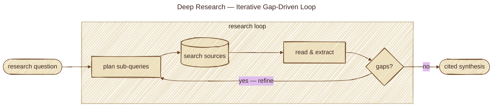

# Deep Research Pattern

## Overview

The **Deep Research Pattern** turns "answer this question" into an **iterative research loop** instead of a one-shot completion: plan → search → reflect → follow-up → synthesize. The agent decomposes a question into sub-questions, gathers evidence over multiple rounds, identifies what's still missing, runs targeted follow-ups, and only then produces a cited synthesis.

It differs from a single RAG retrieval in scope and shape — RAG fetches *once* into one prompt; deep research fetches *many times* with reflection between rounds, and emits a report with traceable citations rather than a chat reply.

## Architecture



## How It Works

1. **Plan**: decompose the question into a structured set of sub-questions and identify the evidence each requires.
2. **Search**: run targeted queries (web search, vector retrieval, internal corpora) against each sub-question.
3. **Reflect / gap-analyze**: examine the evidence collected so far and identify what's missing, contradictory, or under-supported.
4. **Follow-up**: emit a new wave of queries aimed at the identified gaps.
5. **Repeat steps 2–4** until coverage is sufficient (budget, depth, or confidence threshold).
6. **Synthesize**: produce a cited report — claims linked to the source documents that supported them.

### Iterative loop

```
        ┌────── plan ──────┐
        │                  ▼
        │       ┌──── search ────┐
        │       │                │
        │       ▼                │
   reflect / gap-analyze ────────┘  (decide: enough? new gaps?)
        │
        ▼
   synthesize (cited)
```

### Basic vs. advanced shape

- **Basic**: two-round loop (initial search → reflect → one follow-up round → synthesize). Demonstrates the *shape* with minimal moving parts.
- **Advanced**: structured plan up front, explicit per-claim gap analysis, citation tracking across rounds, and a final synthesis where every claim links to its source.

## Key Benefits

- **Coverage**: addresses questions too broad or too multi-faceted for a single retrieval to satisfy.
- **Self-correction**: reflection rounds catch missing evidence before the synthesis stage commits to a flawed answer.
- **Auditability**: claims are cited; readers can trace why the agent believes what it asserts.
- **Budget control**: the loop has explicit termination criteria (depth, claims-covered, confidence threshold) rather than running until time runs out.

## When to Use This Pattern

**Rule of Thumb**: Use Deep Research when the question has **multiple sub-questions, no single authoritative source, and the answer must be defensible**.

### Ideal Use Cases

- **Market / competitive analyses**: "What are the leading approaches to X, who's shipping them, and what are the tradeoffs?"
- **Literature surveys**: pulling together what multiple papers say on a topic with proper attribution.
- **Investment / diligence write-ups**: where claims need sources and gaps need to be acknowledged.
- **Multi-hop fact-finding**: where the first answer raises follow-up questions you didn't know to ask up front.
- **Technical comparisons**: feature matrices that need verifying across many vendor docs.

### When NOT to Use

- Simple lookups answered by a single retrieval.
- Conversational / chat use cases where back-and-forth replaces a research loop.
- Questions with one obvious authoritative source — go fetch it directly.
- Latency-sensitive paths — deep research is slow by construction (multiple rounds × multiple searches).

## Implementation Considerations

- **Search backend**: web search (Tavily, Brave, Bing), vector store (your private corpus), or both. Each round may pick a different one.
- **Citation tracking**: every retrieved document needs a stable handle (URL + retrieval timestamp, doc id + chunk id) so the synthesis can cite it.
- **Termination criteria**: depth cap (e.g., 3 rounds), coverage cap (every sub-question has ≥ N supporting sources), or LLM-judged "enough?" verdict.
- **Reflection quality**: the gap analysis is where the loop earns its keep — make it explicit and structured, not "do you have enough?".
- **De-duplication**: across rounds the same source will be retrieved repeatedly; track what's already in context.
- **Cost / token budget**: deep research is multi-round, multi-search, often multi-model — instrument it.
- **Failure modes**: search returning nothing on a key sub-question is a research failure; surface it instead of fabricating coverage.

## Example Architecture

```
                ┌───────────────────────────┐
                │   Planner: question →     │
                │   {q1, q2, …, qN}         │
                └─────────────┬─────────────┘
                              │
                              ▼
        ┌────────────────────────────────────────┐
        │   Loop (rounds 1..R, until stop)        │
        │                                         │
        │   ┌───────────┐    ┌──────────────────┐ │
        │   │ Search(qi)│ →  │  Evidence store  │ │
        │   └───────────┘    └────────┬─────────┘ │
        │                              │           │
        │                              ▼           │
        │                    ┌──────────────────┐ │
        │                    │  Reflect / gaps  │ │
        │                    │  → next-queries  │ │
        │                    └──────────────────┘ │
        └─────────────────────────┬───────────────┘
                                  │
                                  ▼
                ┌───────────────────────────┐
                │   Synthesizer (cited)     │
                └───────────────────────────┘
```

## Related Patterns

- **RAG**: a single retrieval pass — deep research's per-round building block.
- **Reflection**: the gap-analysis step is reflection narrowed to "what's missing?".
- **Planning**: the plan stage at the top is the Planning pattern in miniature.
- **Tool Use**: each search is a tool call.
- **Memory Management**: across rounds, the evidence store IS the memory.

## Related framings (absorbed)

This pattern absorbs the older **Exploration & Discovery** framing (ε-greedy: balance *explore* vs. *exploit*). The plan → search → reflect → synthesize loop here is the structured, citation-aware successor: gap-analysis plays the role the ε-greedy explore-decision used to play, but on accumulated evidence rather than abstract policy state. The standalone `reasoning/exploration_discovery/` chapter was removed in 2026-06; consult git history if you want the pure ε-greedy demo.

## Demos in this directory

- `src/deep_research_basic.py`: two-round iterative loop.
- `src/deep_research_advanced.py`: structured plan + gap analysis + cited synthesis.

Run:

```bash
uv sync
bash run.sh
```

## Corporate SSL proxy note

If you're behind a corporate SSL-inspecting proxy, run examples with:

```bash
AGENTIC_DISABLE_SSL=1 bash run.sh
```

---

*Deep research is RAG plus reflection plus citation — the difference between "one fetch and a guess" and "many fetches and a defensible answer".*
